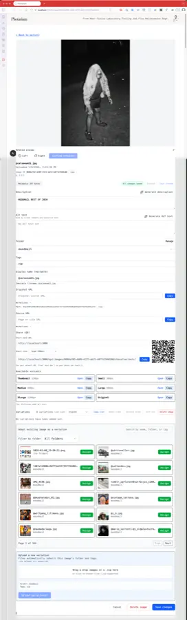
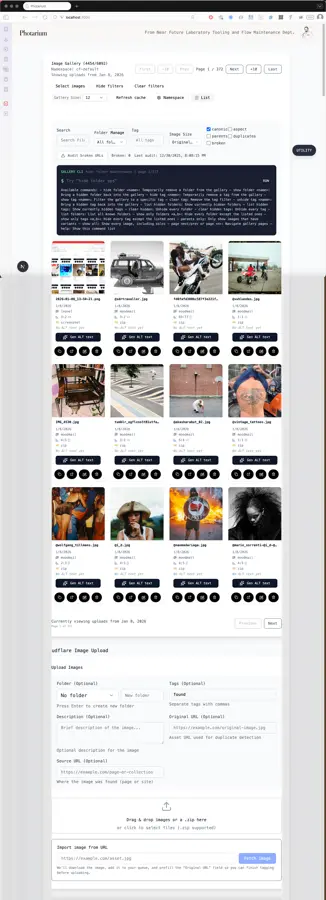

---

# Photarium

**Self-hosted image management** for teams and creators.  
Upload, organize, and distribute images via Cloudflare's global CDN.

[Quick Start](#quick-start) · [API Docs](./EXTERNAL_UPLOAD_API.md) · [Configuration](./docs/namespace.md) · [Website](https://bleeckerj.github.io/nfl-photarium/) · [GitHub](https://github.com/bleeckerj/nfl-photarium)

---

## What is Photarium?

> **⚠️ SECURITY WARNING**: Photarium is currently designed for **local usage only** (running on your own machine or a secured internal network).
> The external upload API endpoint (`/api/upload/external`) currently has **NO authentication** and accepts uploads from any source.
> Do not deploy this to a public URL (like Vercel, Netlify, or a public VPS) without first adding authentication middleware or securing access at the network level.
> *Securing this API might be a high-priority item on our roadmap? If there were a roadmap, really? But at the moment I run this entirely locally, at or very close to localhost and the only person who might hack me has four paws, so I'm not super concerned..but you should be if you intend to run this anywhere you are not certain has some security in front of that endpoint.*

Photarium is a lightweight, self-hosted web application that turns Cloudflare Images into a complete asset management system. Perfect for:

- **Email campaigns** — Organize and share images across your marketing team
- **Website management** — Version control and quick distribution of web assets  
- **Content creators** — Rapid upload, tagging, and URL generation
- **Multi-app deployments** — Namespace isolation for different projects on one Cloudflare account

No vendor lock-in. Run it on your own infrastructure.

---

## Features

- **Upload & Organize** — Drag-and-drop interface with folder and tag support
- **Search & Filter** — Find images by name, folder, tag, or date range
- **Dual View Modes** — Grid view for visual browsing, list view for bulk operations
- **Smart Pagination** — Date-aware page controls with sticky filters
- **AI-Generated ALT Text** — Auto-generate accessible descriptions (via GPT-4o mini)
- **Image Variants** — Automatic responsive sizing (thumbnail, medium, large, public)
- **External API** — Programmatic upload from Astro, Node scripts, or any HTTP client
- **Namespace Support** — Logical isolation for multi-tenant or multi-app setups
- **CDN Delivery** — Lightning-fast global distribution via Cloudflare's network
- **Dark-mode Ready** — Responsive design, works on desktop and mobile

### Deep Control & Variants



Every image includes a powerful detail view for granular control:

- **Metadata Management**: Edit title, folder, description, and tags while preserving original EXIF data.
- **Variant Assignment**: Designate specific images as variants (e.g., "Thumbnail," "Social Share") of a parent image. This keeps your library clean by grouping related assets under a single "master" image while serving optimized versions for specific contexts.
- **Accessibility**: Generate and edit ALT text to ensure your assets are accessible everywhere.

### Organized Gallery Management



The main gallery offers a clean, efficient way to browse and organize thousands of assets:

- **Smart Filtering**: Drill down by matching folders, tags, or specific time ranges.
- **Sticky Controls**: Filter/Sort bar stays pinned to the top, so you never lose context while scrolling deep lists.
- **Quick Actions**: Hover over any image for instant access to copy URL, edit metadata, or download.

---

## Requirements

Before you start, you'll need:

- **Node.js 18+** with npm
- **A Cloudflare account** (free tier available)
  - [Create a free account →](https://dash.cloudflare.com/sign-up)
  - [Enable Cloudflare Images →](https://dash.cloudflare.com/?to=/:account/images/getting-started) (100k images/month, free)
- **ffmpeg** — Required for creating animated WebP images
  - macOS: `brew install ffmpeg`
  - Ubuntu/Debian: `sudo apt install ffmpeg`
  - Windows: [Download from ffmpeg.org](https://ffmpeg.org/download.html)
- **Optional:** OpenAI API key for AI ALT text generation
- **Optional:** Redis Stack (via Docker or Cloud) for AI Semantic Search Features

---

## Deployment Options

### 🚀 Simplified Mode (No Database)
Deploy anywhere (Vercel, Railway, etc.) without managing a database.
- **Features**: Upload, Gallery, Folders, Tags, basic filtering.
- **Limitations**: No "semantic search" (finding images by describing them) or color search.
- **Setup**: Just omit the `REDIS_URL` environment variable.

### 🧠 Full AI Mode (with Redis)
Unlock the full power of Photarium by connecting a Redis Stack instance.
- **Features**: Everything above + **Semantic Search**, **Color Search**, and **"Find Similar"**.
- **Setup**: 
  1. spin up a Redis Stack instance (see [Deployment Guide](./DEPLOYMENT.md)).
  2. Set `CACHE_STORAGE_TYPE=redis` and `REDIS_URL`.

---

## Quick Start

### 1. Clone & Install

```bash
git clone https://github.com/bleeckerj/nfl-photarium.git
cd nfl-photarium
npm install
```

### 2. Configure Cloudflare

Grab three values from your Cloudflare dashboard:

1. **Account ID** — [Dashboard → right sidebar](https://dash.cloudflare.com/)
2. **API Token** — [API Tokens → Create Token](https://dash.cloudflare.com/profile/api-tokens)
   - Template: Custom token
   - Permission: `Cloudflare Images:Edit`
   - Resources: Your account
3. **Account Hash** — [Cloudflare Images dashboard](https://dash.cloudflare.com/?to=/:account/images/overview)

### 3. Environment Variables

```bash
cp .env.example .env.local
```

Edit `.env.local`:

```env
CLOUDFLARE_ACCOUNT_ID=abc123
CLOUDFLARE_API_TOKEN=your_token_here
NEXT_PUBLIC_CLOUDFLARE_ACCOUNT_HASH=your_hash_here
IMAGE_NAMESPACE=default
NEXT_PUBLIC_IMAGE_NAMESPACE=default
```

**What these do:**
- `IMAGE_NAMESPACE` — Scopes uploads and duplicate detection (prevents collisions across projects)
- `NEXT_PUBLIC_IMAGE_NAMESPACE` — Seeds the UI; override anytime in app settings

### 4. Run It

```bash
npm run dev
```

Open [http://localhost:3000](http://localhost:3000)

---

## Usage

### Uploading Images

1. Drag and drop into the upload area, or click to browse
2. (Optional) Select a folder and add comma-separated tags
3. Watch progress and copy the permanent Cloudflare URL

### Importing from URLs

- **Single image URL**: Fetch an image into the queue, edit metadata, then upload.
- **Page URL**: Scan a page for images, preview thumbnails in the queue, select what you want, and upload the rest.
  - Picks the largest `srcset` candidate when multiple sizes are available.
  - Filters out tiny assets below 8 KB.
  - Shows a placeholder when a preview is blocked; ingestion still works server-side.

### Finding Images

Use the search bar for filename/folder/tag lookups, or filter by specific criteria:
- **Grid View** — Visual browsing
- **List View** — Bulk operations and detailed metadata
- **Pagination** — Date-labeled controls jump between pages of 12

### Organizing Your Library

**Email Campaigns:**
```
Folder: email-campaigns
Tags: newsletter, promo, header
```

**Website Assets:**
```
Folder: website-images
Tags: hero, about, testimonial
```

**Social Media:**
```
Folder: social-media
Tags: instagram, facebook, linkedin
```

---

## External API

Push images from scripts, Astro components, or any HTTP client:

```bash
curl -X POST http://localhost:3000/api/upload/external \
  -F "file=@photo.png" \
  -F "folder=campaign-2025" \
  -F "tags=newsletter,featured" \
  -F "namespace=production"
```

**Fields:**
| Name | Required | Notes |
|------|----------|-------|
| `file` | ✅ | Image file (max 10 MB) |
| `folder` | ❌ | Folder name |
| `tags` | ❌ | Comma-separated list |
| `namespace` | ❌ | Override default namespace |
| `originalUrl` | ❌ | For duplicate detection |

**Response:**
```json
{
  "id": "abc123",
  "url": "https://imagedelivery.net/HASH/abc123/public",
  "variants": ["public", "thumbnail", "medium", "large"],
  "uploaded": "2025-01-08T14:22:00Z"
}
```

For detailed examples (Node scripts, Astro integration, remote URLs), see [EXTERNAL_UPLOAD_API.md](./EXTERNAL_UPLOAD_API.md).

---

## File System Watcher (Optional)

Automatically upload images from a folder:

```bash
npm run watch:drop-off
```

Watches `./drop-off`, uploads to the `drop-off` folder with tag `found`. Configure with env vars:

```env
DROP_OFF_DIR=/path/to/watch
DROP_OFF_FOLDER=drop-off
DROP_OFF_TAGS=found
```

---

## Architecture

**Self-hosted** — Run on your own server, Vercel, Railway, or any Node.js host  
**Stateless** — All metadata stored in Cloudflare; no database required  
**Namespace-aware** — Isolate images across projects or teams on one account

---

## Deployment

### Vercel (Recommended)

1. Push to GitHub
2. [Connect to Vercel](https://vercel.com/import)
3. Add env vars in dashboard
4. Deploy

### Other Platforms

Works on any platform supporting Node.js 18+:
- **Railway** — [Docs](https://railway.app/)
- **Render** — [Docs](https://render.com/)
- **DigitalOcean** — App Platform
- **Netlify** — Functions + edge

---

## Tech Stack

| Layer | Technology |
|-------|------------|
| Framework | Next.js 15 (App Router) + TypeScript |
| Styling | Tailwind CSS |
| UI Components | Lucide React icons |
| Image Host | Cloudflare Images API |
| Database | None (serverless) |

---

## Testing

```bash
npm run test
```

Runs the vitest suite (includes external API coverage).

---

## Development

```bash
# Development server (with Turbopack)
npm run dev

# Build for production
npm run build

# Start production server
npm start

# Lint
npm run lint
```

**Scripts:**
- `npm run namespace:backfill` — Tag existing Cloudflare images with a namespace
- `npm run refresh:hash-cache` — Rebuild the duplicate detection cache
- `npm run audit:broken` — Find broken image URLs
- `npm run diag:duplicates` — Analyze duplicate uploads

---

## Documentation

- **[Namespaces](./docs/namespace.md)** — Multi-tenant and multi-app setups
- **[External API](./EXTERNAL_UPLOAD_API.md)** — Full API reference and examples
- **[Image Variants](./docs/variants.md)** — Responsive image sizing
- **[Remote Hash Cache](./docs/remote-hash-cache.md)** — Distributed duplicate detection

---

## Contributing

Found a bug? Have a feature request? Open an issue or PR on [GitHub](https://github.com/bleeckerj/nfl-photarium).

---

## License

MIT
