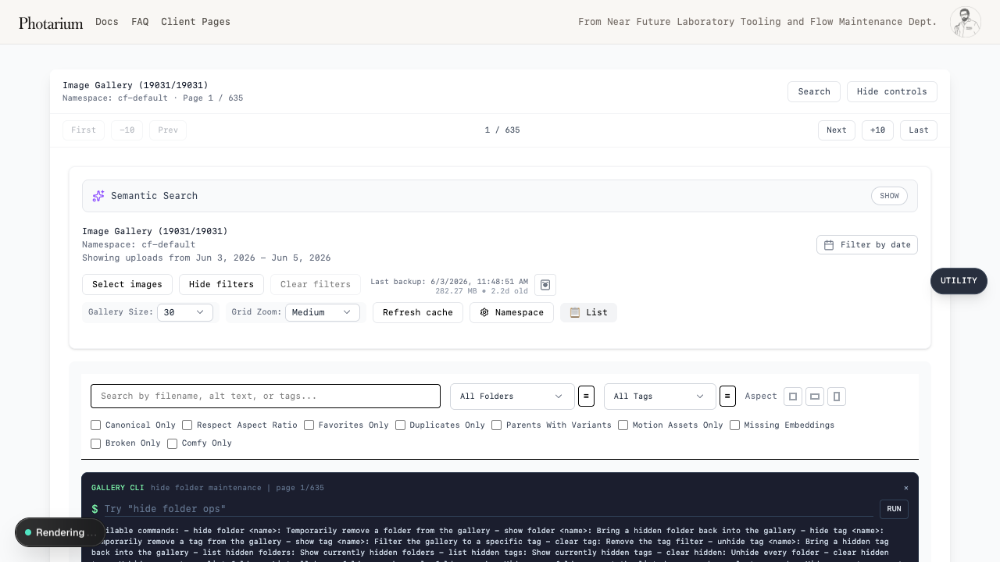
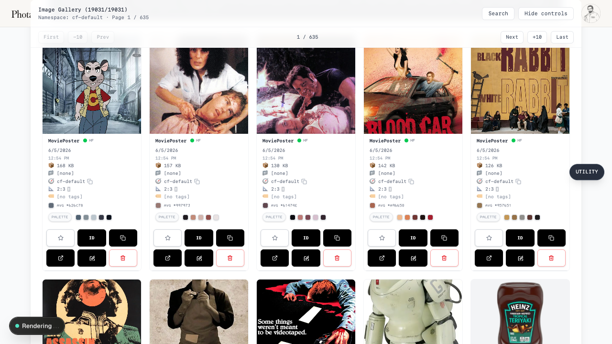
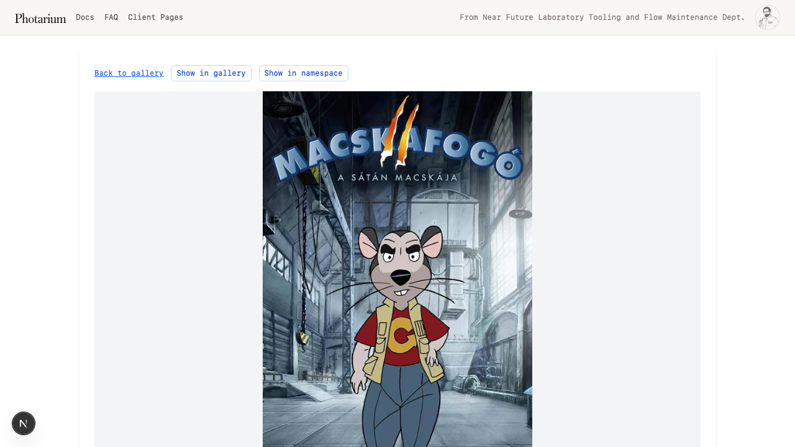
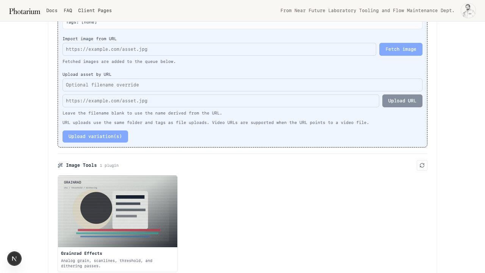
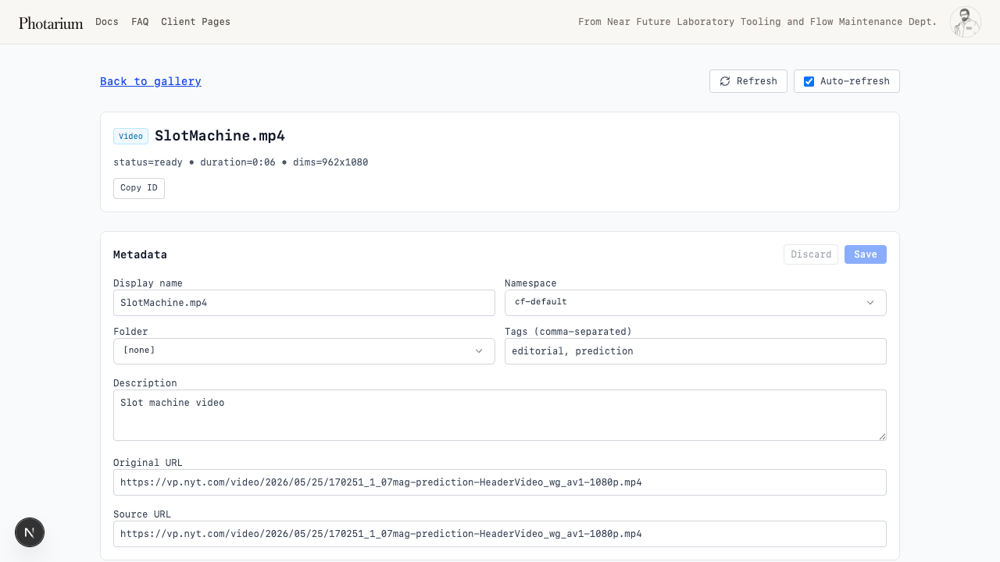
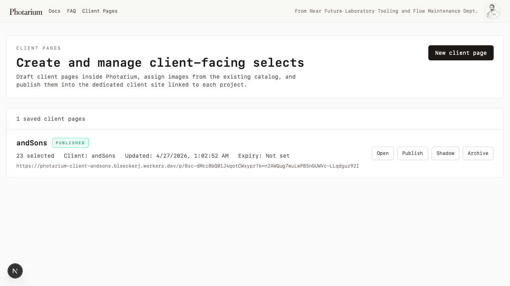
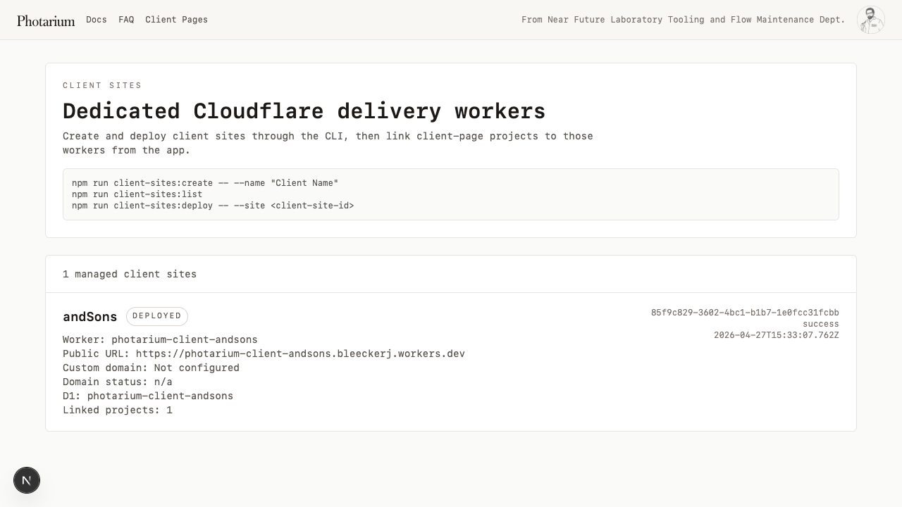
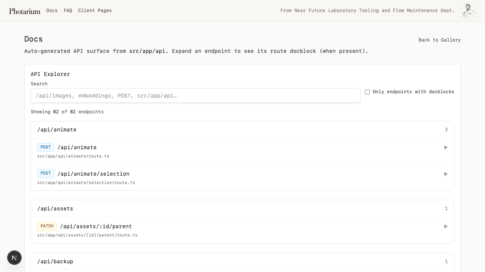

# Photarium

Photarium is a self-hosted visual asset workbench built on Cloudflare Images, Cloudflare Stream, Next.js, and optional Redis-backed discovery. It gives photographers, editors, image researchers, media librarians, and technical operators one local-first surface for ingesting, organizing, enriching, searching, transforming, and publishing image and video libraries.

Use Photarium when you want a working catalog with real operational control: namespaces for projects or clients, folder and tag curation, Cloudflare delivery URLs, AI-assisted metadata, semantic and color search, image-family management, video frame extraction, browser/page ingest, local filesystem ingest, and client-facing review pages.

[Quick Start](#quick-start) | [Screenshot Tour](#screenshot-tour) | [Setup](#setup) | [Workflows](#core-workflows) | [Scripts](#script-reference) | [API](#api-and-integration-surface) | [Docs](#more-documentation)

## Security Model

Photarium is currently designed as a local-first or trusted-internal-network tool. Put authentication, VPN, Cloudflare Access, or another trusted access layer in front of it before exposing it beyond a controlled environment.

The external upload endpoint, `POST /api/upload/external`, is intentionally useful for scripts and adjacent tools. It does not include built-in user authentication. Disable it with `DISABLE_EXTERNAL_API=true` when you do not need script-driven uploads, or protect the full app with trusted network controls.

Never place Cloudflare tokens, OpenAI keys, Redis credentials, Stream tokens, client-site publish secrets, or signing secrets in browser code. Keep them in `.env.local`, deployment secrets, or another server-only secret store.

## What Photarium Does

Photarium combines a practical media catalog with automation hooks:

- Upload single files, batches, ZIP archives, URL-fetched images, URL-uploaded videos, and filesystem archives.
- Organize assets with namespaces, folders, tags, favorites, parent/child families, variants, and display names.
- Browse a large Cloudflare-backed library with date navigation, pagination, grid/list views, filters, bulk editing, and a gallery command bar.
- Enrich records with alt text, descriptions, prompt text, semantic tags, ComfyUI workflow metadata, dominant colors, EXIF, source URLs, and original URLs.
- Search by filename, tags, folder, date, favorites, asset state, semantic text, color, similar images, antipodes, and workflow intent when the optional discovery layer is enabled.
- Work with mixed media: image assets, animated WebP assets, Cloudflare Stream videos, extracted video frames, and video-derived animated WebP previews.
- Run local image tools through the image-tools plugin surface, including Grainrad effects when configured.
- Publish curated client pages into the adjacent `photarium-client-sites` Cloudflare Worker app.
- Integrate headless scripts through REST routes and operational CLIs for page ingest, filesystem ingest, social/source ingest, namespace cleanup, embedding backfills, and client-site deployment.

## Who It Is For

### Photographers, Editors, And Media Librarians

Photarium is useful when your library needs more than a folder tree:

- Keep client work, personal archives, editorial references, and generated images separated by namespace.
- Tag and folder assets without losing the Cloudflare delivery path.
- Save original/source URLs, descriptions, alt text, prompts, and workflow context beside the media.
- Find images by visual idea, color, motion status, folder, tag, date, favorites, or missing metadata.
- Review image families, variants, and related assets from a detail page instead of chasing filenames.
- Extract usable stills from videos and create animated WebP deliverables.
- Prepare client review pages with a controlled asset selection and publish target.

### Technical Operators And Developers

Photarium is also a scriptable media backend:

- REST routes handle upload, external upload, page import, image metadata, video metadata, vector status, image tools, client pages, client sites, and workflow search.
- Server-side services keep Cloudflare, Stream, Redis, OpenAI, filesystem, and image-tool operations out of client code.
- Cache storage can run with local files for simple installs or Redis for richer discovery and faster large-catalog workflows.
- CLI scripts cover Redis startup, embedding backfill/recovery, filesystem ingest, page ingest, social ingest helpers, video frame extraction, namespace repair, duplicate diagnostics, and client-site deployment.
- The adjacent `photarium-client-sites` Worker turns internal selections into public-facing review galleries backed by D1 and optional custom domains.

## Screenshot Tour

The screenshots below were captured from the local app running at `http://localhost:3000` on June 5, 2026. They show the main production surfaces rather than mockups.

### Gallery Overview



The gallery is the main catalog workspace. It shows namespace scope, pagination, semantic-search access, date filtering, bulk selection, cache refresh, namespace controls, grid-size controls, list/grid switching, folder and tag filters, aspect filters, search-exclusion filters, and a command panel for gallery maintenance.

### Gallery Results



The results area is built for scanning large libraries. Cards expose visual previews, metadata, embedding state, dominant-color information, asset type, and quick entry into detail workflows.

### Image Detail



Image detail pages focus on curation. They include navigation back to the gallery state, namespace-aware links, the selected asset, metadata editing, folder/tag/display-name controls, alt and description workflows, original/source URL fields, family information, variants, crop-variant creation, variation upload/adoption, sharing, semantic neighbors, ComfyUI metadata when available, and deletion controls.

### Image Tools



The image tools panel is a server-side plugin surface for asset transformations. The current local setup exposes the Grainrad effects panel, with preview/run APIs that keep privileged service calls on the server side.

### Video Detail



Video detail pages manage Cloudflare Stream-backed motion assets. They show stream status, duration, dimensions, namespace, folder, tags, description, original/source URL, refresh controls, metadata editing, frame extraction, download helpers, and animated WebP generation.

### Client Pages



Client pages let you assemble curated review selections from the internal library. They are the handoff layer between Photarium and client-facing galleries.

### Client Sites



Client sites manage the publish targets for client pages. A site can be deployed to the adjacent Cloudflare Worker, backed by D1, and optionally attached to a clean client subdomain.

### Built-In Docs



The app includes a local docs route for API and workflow reference while you are operating the catalog.

## Quick Start

### 1. Install Dependencies

```bash
git clone https://github.com/bleeckerj/nfl-photarium.git
cd nfl-photarium
npm install
```

### 2. Create Your Environment File

```bash
cp .env.example .env.local
```

Edit `.env.local` with your real server-only values. At minimum, set Cloudflare Images credentials:

```env
CLOUDFLARE_ACCOUNT_ID=your_account_id_here
CLOUDFLARE_API_TOKEN=your_cloudflare_images_token_here
NEXT_PUBLIC_CLOUDFLARE_ACCOUNT_HASH=your_images_account_hash_here
IMAGE_NAMESPACE=default
NEXT_PUBLIC_IMAGE_NAMESPACE=default
CACHE_STORAGE_TYPE=file
```

### 3. Run The App

```bash
npm run dev
```

Open [http://localhost:3000](http://localhost:3000).

### 4. Upload And Curate

1. Choose a namespace in the UI.
2. Upload images or import by URL/page.
3. Add folder, tags, display names, descriptions, and alt text.
4. Use gallery filters and detail pages to build a library structure.
5. Enable optional Redis/OpenAI/Stream/Client Sites features as your workflow grows.

## Requirements

| Requirement | Purpose |
| --- | --- |
| Node.js 18+ and npm | Runs the Next.js app, scripts, and tests. |
| Cloudflare account | Stores and serves images through Cloudflare Images. |
| Cloudflare Images API token | Uploads and updates image assets and metadata. |
| Cloudflare Images account hash | Builds public delivery URLs. |
| ffmpeg and ffprobe | Required for video frame extraction and animated WebP workflows. |
| Redis Stack or compatible Redis with vector support | Optional, but required for semantic search, color search, similar/antipode discovery, and large-catalog Redis cache workflows. |
| OpenAI API key | Optional, used for generated alt text, descriptions, display names, semantic tags, and related enrichment routes. |
| Cloudflare Stream API token | Optional, required for video upload/status/download workflows when using Stream-backed assets. |
| Cloudflare Workers and D1 access | Optional, required for deploying client sites. |
| Grainrad service or repo | Optional, required for Grainrad image-tool effects. |

Install ffmpeg:

```bash
# macOS
brew install ffmpeg

# Ubuntu/Debian
sudo apt install ffmpeg

# Verify WebP encoder support
ffmpeg -encoders | rg webp
```

## Setup

### Cloudflare Images

Create or locate these values in the Cloudflare dashboard:

1. `CLOUDFLARE_ACCOUNT_ID`: Cloudflare account ID.
2. `CLOUDFLARE_API_TOKEN`: API token with Cloudflare Images edit access.
3. `NEXT_PUBLIC_CLOUDFLARE_ACCOUNT_HASH`: Images account hash used in delivery URLs.

Recommended token scope:

- `Cloudflare Images:Edit`
- Account resources limited to the account that owns the image library

### Namespaces

Namespaces separate libraries inside one Cloudflare Images account. Use them for clients, archives, editorial desks, experiments, or source collections.

```env
IMAGE_NAMESPACE=studio-archive
NEXT_PUBLIC_IMAGE_NAMESPACE=studio-archive
```

`IMAGE_NAMESPACE` is the server default. `NEXT_PUBLIC_IMAGE_NAMESPACE` seeds the client UI. Users can switch namespace in the app when multiple namespaces are present.

Useful namespace scripts:

```bash
npm run namespace:scan
npm run namespace:backfill
npm run namespace:assign-missing
```

### Cache Storage

Photarium can run with a file-backed cache:

```env
CACHE_STORAGE_TYPE=file
```

For larger catalogs and discovery features, use Redis:

```env
CACHE_STORAGE_TYPE=redis
REDIS_URL=redis://localhost:6379
```

Start the local Docker Redis service:

```bash
npm run redis:start
```

Inspect Redis:

```bash
npm run redis:status
npm run redis:logs
```

Stop Redis:

```bash
npm run redis:stop
```

### OpenAI Metadata And Tags

Set `OPENAI_API_KEY` when you want AI-assisted enrichment:

```env
OPENAI_API_KEY=your_openai_api_key_here
```

Optional model overrides:

```env
OPENAI_IMAGE_METADATA_MODEL=gpt-4.1-nano
OPENAI_ALT_MODEL=gpt-4.1-nano
OPENAI_DESCRIPTION_MODEL=gpt-4.1-nano
OPENAI_DISPLAY_NAME_MODEL=gpt-4.1-nano
OPENAI_PROMPT_MODEL=gpt-4.1-nano
OPENAI_TAGS_MODEL=gpt-4.1-nano
OPENAI_HAIKU_MODEL=gpt-4.1-nano
```

All image metadata generators default to `gpt-4.1-nano` unless a shared or per-generator override is set.

AI-assisted routes can generate or refine:

- alt text
- descriptions
- display names
- semantic tags
- Prompt This text
- embeddings and search metadata when paired with the discovery layer

### Embeddings And Discovery

The development script enables auto-embedding behavior for local uploads through the package script. To recover or backfill a library:

```bash
npm run embeddings:status
npm run embeddings:recover:dry-run
npm run embeddings:recover
```

Targeted backfill examples:

```bash
npm run embeddings:backfill -- --namespace=studio-archive
npm run embeddings:backfill -- --limit=250 --throttle-ms=300 --batch=20 --delay=2000 -vv
npm run embeddings:backfill -- --color-only --checkpoint-file ./data/embedding-backfill-checkpoints/color-pass.json
```

The recovery command persists progress at `data/embedding-backfill-checkpoints/recover-all.json`, verifies live Redis state, and is safe to rerun after interruption.

### Video And Cloudflare Stream

Video support uses Cloudflare Stream plus local ffmpeg tooling:

```env
CLOUDFLARE_STREAM_API_TOKEN=your_stream_token_here
ENABLE_VIDEO_ASSETS=1
MAX_VIDEO_UPLOAD_BYTES=104857600
VIDEO_ASSET_LIST_LIMIT=300
```

Optional playback URL setting:

```env
CLOUDFLARE_STREAM_CUSTOMER_SUBDOMAIN=customer-xxxx
```

Video workflows include:

- upload from local files or URL-backed page import
- list video assets inside the gallery when `ENABLE_VIDEO_ASSETS=1`
- edit video display name, namespace, folder, tags, description, source URL, and original URL
- refresh Cloudflare Stream status
- extract specific frames
- generate animated WebP previews/variations from selected time ranges
- download or proxy video files when source metadata permits it

Frame extraction CLI:

```bash
npm run video:frames -- --video-id <video-id> --selector "first,middle,last"
```

### Page And Browser Ingest

Page ingest can scan pages for image and video candidates:

```bash
npm run page:ingest -- ingest --namespace studio-archive --url https://example.com/gallery
```

Browser-backed ingest supports scrolling and dynamic pages:

```bash
npm run page:browser-ingest -- --namespace studio-archive --url https://example.com/gallery --max-scrolls 10
```

Important options:

- `--mode scroll|html`: choose browser scroll scanning or static HTML extraction.
- `--cookie-header` / `--cookie-file`: scan pages that need authenticated cookies.
- `--allow-insecure`: allow insecure TLS for specific trusted imports.
- `--folder`, `--tags`, `--description`: stamp uploaded candidates.
- `--dry-run`: scan without uploading.
- `--include-regex`: keep only matching URLs in browser ingest.

Environment defaults:

```env
IMPORT_ALLOW_INSECURE_TLS=false
IMPORT_SCROLL_MAX_SCROLLS=10
IMPORT_SCROLL_TIMEOUT_MS=30000
```

### Filesystem And Archive Ingest

Use filesystem ingest for local archives, downloaded collections, or source exports:

```bash
npm run fs:ingest -- \
  --root /path/to/archive \
  --namespace studio-archive \
  --folder archive-import \
  --include-path-tags \
  --ai-metadata \
  --tag-count 4 \
  --throttle-ms 500 \
  --dry-run \
  --verbose
```

Run for real by removing `--dry-run`:

```bash
npm run fs:ingest -- \
  --root /path/to/archive \
  --namespace studio-archive \
  --folder archive-import \
  --description-prefix "Studio archive import" \
  --include-path-tags \
  --ai-metadata \
  --tag-count 4 \
  --throttle-ms 500
```

The filesystem ingest script:

- walks nested folders
- uploads supported images and videos
- keeps checkpoint state under `data/fs-ingest-checkpoints/`
- skips unchanged files on later runs
- can add path-derived tags
- can request AI-generated display names and tags for images
- can report Flickr sidecar metadata when configured

### Image Tools And Grainrad

The image tools layer lists available server-side tools at `/api/image-tools`. The Grainrad integration supports analog grain/scanline (VHS), threshold, dithering, and halftone passes through preview and run routes.

Grainrad runs **in-process** as the `nfl-grainrad-clone` library — there is no
separate service to start and no configuration. The plugin is wired as a
`file:../nfl-grainrad-clone` dependency and kept as a `serverExternalPackages`
runtime external. Photarium decodes the source with `sharp`, hands the RGBA
raster to the grainrad engine, and encodes the result with `sharp` (PNG/WebP/JPEG
stills, GIF/animated-WebP). MP4 animated exports use the host `ffmpeg` (set
`FFMPEG_PATH` if it is not on `PATH`).

Because rendering is a function call, the plugin works on any host (including
serverless) with no managed startup, port scanning, or health checks.

This starts or contacts the configured Grainrad service and exercises the Photarium image-tool API against real Grainrad render/export endpoints with PNG, WebP, and JPEG source fixtures.

### Client Sites Publishing

Client pages are created in Photarium. Client sites are deployed through the adjacent Worker app at `adjacent/photarium-client-sites`.

Minimum publish target settings:

```env
CLIENT_SITES_TARGET_BASE_URL=https://photos.example.com
CLIENT_SITES_PUBLISH_SECRET=shared_secret_for_worker_publish_route
CLIENT_SITES_PUBLIC_BASE_URL=https://photos.example.com
```

Cloudflare Worker/D1 deployment settings:

```env
CLOUDFLARE_ACCOUNT_ID=your_account_id_here
CLIENT_SITES_CLOUDFLARE_API_TOKEN=your_workers_and_d1_token_here
NEXT_PUBLIC_CLOUDFLARE_ACCOUNT_HASH=your_images_account_hash_here
```

Optional clean client subdomains:

```env
CLIENT_SITES_BASE_DOMAIN=clients.example.com
CLIENT_SITES_ZONE_ID=your_cloudflare_zone_id_here
CLIENT_SITES_USE_CUSTOM_DOMAINS=true
```

Create and deploy a site:

```bash
npm run client-sites:create -- --name "Acme Studio"
npm run client-sites:list
npm run client-sites:doctor -- --site <client-site-id>
```

Publish a client page:

```bash
npm run client-sites:publish -- --project <project-id>
```

Republish:

```bash
npm run client-sites:republish -- --project <project-id>
npm run client-sites:republish -- --all-published
```

When custom domains are configured, a client slug such as `acme-studio` can publish to:

```text
https://acme-studio.clients.example.com/p/<public-slug>?k=<access-key>
```

### External Upload API

External uploads are useful for scripts, Astro/Next apps, ingest jobs, and automation:

```bash
curl -X POST http://localhost:3000/api/upload/external \
  -F "file=@photo.png" \
  -F "folder=campaign-2026" \
  -F "tags=newsletter,featured" \
  -F "namespace=studio-archive"
```

Accepted fields include:

| Field | Required | Notes |
| --- | --- | --- |
| `file` | yes | Image file. Size limits are enforced by the upload route. |
| `folder` | no | Folder label stored in Cloudflare metadata. |
| `tags` | no | Comma-separated tags. |
| `namespace` | no | Overrides the default namespace. |
| `originalUrl` | no | Used for source tracking and duplicate handling. |
| `sourceUrl` | no | Canonical source page or source asset URL. |
| `description` | no | Stored as asset metadata/extras when supported. |
| `duplicateAction` | no | `reject`, `family`, or `override` for operator-confirmed duplicate false positives. |

See [EXTERNAL_UPLOAD_API.md](./EXTERNAL_UPLOAD_API.md) and [docs/HEADLESS_API.md](./docs/HEADLESS_API.md) for more route-level detail.

## Core Workflows

### Uploading Assets

1. Pick or create a namespace.
2. Choose a folder and tags before upload when you already know the structure.
3. Drag files into the uploader, select files through the browser, import an image URL, upload an asset by URL, or feed a script route.
4. Let Photarium upload to Cloudflare Images or Stream.
5. Review the uploaded list and open detail pages for curation.
6. Generate missing metadata, add source context, and assign variants or parent relationships.

Supported media paths:

- image file upload
- ZIP image import
- image URL fetch
- asset URL upload
- page scan and page upload, with optional review of below-threshold small assets
- video file upload
- video URL upload
- filesystem ingest
- Instagram, Flickr, Threads, Telegram, Discord-oriented helper scripts

Page scans hide small assets by default. In the uploader's "Scan a page for media" controls, enable **Include small assets** to show candidates below the configurable threshold. The default threshold is `0.05 MB`, adjustable in `0.025 MB` steps. Below-threshold candidates appear muted and unselected in the queue; select an individual row's **Include** checkbox to upload it.

### Organizing A Library

Common structures:

```text
Namespace: wedding-2026
Folders: ceremony, portraits, reception, selects
Tags: client-approved, black-and-white, print, web, needs-retouch
```

```text
Namespace: editorial
Folders: source-pages, candidates, finals, video, webp
Tags: article-slug, hero, crop-needed, licensed, embargoed
```

```text
Namespace: generated-study
Folders: comfy, references, variants, rejected
Tags: prompt-this, workflow-json, seed-family, final-pass
```

Use parent/child families for alternates, retouches, outputs, and derived assets. Use namespaces for project-level isolation. Use folders and tags for librarian-facing retrieval.

### Searching And Discovery

Basic gallery search works across filenames, folders, tags, and text metadata. Additional filters cover:

- folder
- tag
- aspect/orientation
- date range
- favorites
- duplicates
- parents with variants
- motion assets
- missing embeddings
- broken assets
- Comfy metadata
- canonical-only results
- respect-aspect-ratio state
- search exclusion tags

Redis/vector features add:

- semantic text search
- similar images by CLIP
- color search
- color neighbors
- antipode search
- workflow intent search
- embedding status and missing-embedding recovery

### Image Detail Curation

Use image detail pages for:

- display-name editing
- folder and tag editing
- alt text generation and editing
- description editing
- Prompt This text
- share links
- source URL and original URL tracking
- namespace movement
- variation upload
- crop variants from still or animated originals
- non-destructive rotation for still images and animated WebP assets, preserving animation frames and timing
- adopting an existing asset as a variation
- parent/child family review
- image deletion and family deletion
- Comfy workflow inspection
- semantic neighbors and related assets
- image tools and transformations

### Video Detail Curation

Use video detail pages for:

- Cloudflare Stream status refresh
- display-name editing
- namespace/folder/tag edits
- description, source URL, and original URL edits
- copying IDs
- frame extraction
- video download helper routes
- non-destructive video rotation with audio preservation and Cloudflare Stream re-upload
- animated WebP generation from selected segments
- mixed image/video family workflows when enabled

### Client Review Publishing

1. Create a client site or choose an existing one.
2. Create a client page in Photarium.
3. Add selected assets to the page.
4. Publish from the UI or with `npm run client-sites:publish`.
5. Send the generated client URL.
6. Republish when the selection changes.

The internal Photarium app remains the source of truth. The adjacent Worker serves the client-facing view.

## API And Integration Surface

Representative routes:

| Route | Purpose |
| --- | --- |
| `GET /api/images` | List gallery assets with namespace, pagination, filters, vector metadata, extras, facets, and optional videos. |
| `POST /api/upload` | Internal image upload route. |
| `POST /api/upload/external` | Script-friendly external image upload route. |
| `POST /api/import` | Import a direct image URL. |
| `POST /api/import/page` | Scan a page and return media candidates, including optional below-threshold small-asset review candidates. |
| `POST /api/import/page/upload` | Upload selected page image candidates. |
| `POST /api/import/page/upload-video` | Upload selected page video candidates or video files. |
| `GET /api/images/:id` | Fetch image detail metadata. |
| `PATCH /api/images/:id` | Update image metadata. |
| `GET /api/images/:id/family` | Fetch parent/child family context. |
| `POST /api/images/:id/rotate` | Create a rotated image derivative; animated WebP inputs preserve frames, delays, transparency, and loop behavior. |
| `POST /api/images/:id/alt` | Generate or save alt text. |
| `GET /api/images/:id/similar` | Fetch semantic/color neighbors when embeddings are available. |
| `GET /api/images/colors` | Fetch stored dominant colors for gallery cards. |
| `POST /api/images/search` | Semantic/color search surface. |
| `GET /api/videos/:id` | Fetch video detail metadata. |
| `PATCH /api/videos/:id/update` | Update video metadata. |
| `POST /api/videos/:id/frames/extract` | Extract frames from video assets. |
| `POST /api/videos/:id/rotate` | Create a rotated MP4 derivative in Cloudflare Stream while preserving optional audio. |
| `POST /api/videos/:id/animated-webp` | Generate animated WebP outputs from video assets. |
| `GET /api/image-tools` | List configured image-tool plugins. |
| `POST /api/image-tools/:toolId/previews` | Create image-tool previews. |
| `POST /api/image-tools/:toolId/runs` | Run an image-tool transformation. |
| `GET /api/client-pages` | List client page projects. |
| `POST /api/client-pages` | Create a client page project. |
| `POST /api/client-pages/:projectId/publish` | Publish a client page. |
| `GET /api/client-sites` | List client-site targets. |
| `POST /api/client-sites` | Create a client-site target. |
| `POST /api/client-sites/publish` | Publish through client-site service route. |
| `GET /api/workflows/search` | Search workflow metadata. |

For complete request/response detail, use [docs/HEADLESS_API.md](./docs/HEADLESS_API.md).

## Script Reference

### Development And Verification

```bash
npm run dev
npm run dev:full
npm run build
npm run lint
npm run test
npm run hygiene:targeted
npm run hygiene
```

`npm run hygiene` is the full local quality gate: size audit, lint, tests, and production build.

### Redis And Embeddings

```bash
npm run redis:start
npm run redis:status
npm run redis:logs
npm run redis:stop
npm run embeddings:status
npm run embeddings:generate
npm run embeddings:backfill
npm run embeddings:recover:dry-run
npm run embeddings:recover
```

### Catalog Maintenance

```bash
npm run refresh:hash-cache
npm run diag:duplicates
npm run audit:broken
npm run namespace:scan
npm run namespace:backfill
npm run namespace:assign-missing
npm run variants:folderize
npm run aspect:backfill
npm run image:metadata:backfill
npm run video:metadata:backfill
```

### Ingest

```bash
npm run page:ingest
npm run page:browser-ingest
npm run page:auth-help
npm run fs:ingest
npm run media:ingest
npm run dng:ingest
npm run snagit:ingest
```

### Social And Source Helpers

```bash
npm run ig:auth
npm run ig:ingest
npm run ig:url
npm run ig:videos
npm run ig:recover-videos
npm run flickr:auth
npm run flickr:ingest
npm run threads:auth
npm run threads:url
npm run telegram:listen
```

These helpers are designed for source collections you control or are authorized to archive. Review platform terms and rights before ingesting third-party media.

### Client Sites

```bash
npm run client-sites
npm run client-sites:create
npm run client-sites:list
npm run client-sites:publish
npm run client-sites:republish
npm run client-sites:deploy
npm run client-sites:refresh
npm run client-sites:doctor
npm run client-sites:delete
```

## Architecture

```text
Photarium
|
|-- Next.js App Router UI
|   |-- Gallery
|   |-- Image detail
|   |-- Video detail
|   |-- Client pages
|   |-- Client sites
|   `-- Local docs
|
|-- Next.js API routes
|   |-- Upload/import routes
|   |-- Cloudflare Images routes
|   |-- Cloudflare Stream routes
|   |-- Metadata/extras routes
|   |-- Search/vector routes
|   |-- Image-tool routes
|   `-- Client publishing routes
|
|-- Server services
|   |-- Cloudflare Images and Stream clients
|   |-- Gallery query and cache orchestration
|   |-- Extras storage
|   |-- Embeddings and vector search
|   |-- Video processing helpers
|   |-- Client-site deploy/publish services
|   `-- Image-tool adapters
|
|-- Optional storage/services
|   |-- Redis Stack
|   |-- OpenAI
|   |-- ffmpeg/ffprobe
|   |-- Grainrad
|   `-- Cloudflare Workers + D1 client sites
```

### Data Ownership

| Data | Location |
| --- | --- |
| Original images | Cloudflare Images |
| Image variants | Cloudflare Images |
| Image metadata | Cloudflare Images metadata plus optional extras storage |
| Rich extras | Redis or file-backed extras storage |
| Videos | Cloudflare Stream |
| Video metadata | Stream metadata plus Photarium metadata records |
| Cache catalog | File cache or Redis cache |
| CLIP/color embeddings | Redis vector storage |
| Client pages | Photarium project records and published Worker manifests |
| Client sites | Adjacent Worker/D1 deployment state |
| Local ingest checkpoints | `data/**` checkpoint folders |

## Deployment Notes

Photarium can run anywhere that supports a long-lived Node/Next.js app and the required server-side environment variables.

Common targets:

- local workstation
- internal server or NAS
- Railway/Render/Fly-style Node host
- Vercel for lighter image-only workflows
- a private network behind Cloudflare Access or VPN

Production reminders:

- Protect the app with authentication or network controls.
- Store secrets in deployment secret management.
- Use `CACHE_STORAGE_TYPE=redis` and a durable Redis instance for large catalogs or vector discovery.
- Grainrad image tools run in-process (no service); ensure `ffmpeg` is available for MP4 exports.
- Configure the Cloudflare Stream token and `ffmpeg` availability for video rotation, frame extraction, animated WebP generation, and MP4 exports.
- Configure client-site Worker tokens separately when publishing client galleries.
- Run `npm run build` before deployment.

## Testing And Hygiene

Use targeted checks during small edits:

```bash
npm run hygiene:targeted
```

Use the full gate before release-facing work:

```bash
npm run hygiene
```

For TypeScript, React, route, server, script, or import-boundary changes, run:

```bash
npm run build
```

The production build catches static rendering, route compatibility, client/server boundary, import/export, and type-contract failures that unit tests may miss.

## Troubleshooting

### Images Upload But Do Not Appear

- Confirm `IMAGE_NAMESPACE` and the UI-selected namespace match.
- Refresh the gallery cache.
- Run `npm run refresh:hash-cache` if duplicate/cache state looks stale.
- Check Cloudflare Images token scope.

### Semantic Search Is Missing Or Empty

- Confirm Redis is running and `CACHE_STORAGE_TYPE=redis`.
- Run `npm run embeddings:status`.
- Run `npm run embeddings:recover:dry-run` to inspect missing embeddings.
- Run `npm run embeddings:recover` to backfill missing CLIP and color embeddings.

### Video Assets Do Not Show In The Gallery

- Set `ENABLE_VIDEO_ASSETS=1`.
- Confirm `CLOUDFLARE_STREAM_API_TOKEN` is configured.
- Check `VIDEO_ASSET_LIST_LIMIT`.
- Open the video detail page and use Refresh to update Stream state.

### Page Import Misses Images

- Use browser/scroll ingest for JavaScript-heavy pages.
- Increase `--max-scrolls`.
- Provide cookies with `--cookie-header` or `--cookie-file` for authenticated pages.
- Use `--include-regex` when the page has many irrelevant assets.

### Client Site Deploy Fails

- Confirm `CLIENT_SITES_CLOUDFLARE_API_TOKEN` has Workers and D1 permissions.
- Confirm `CLOUDFLARE_ACCOUNT_ID`.
- Confirm `CLIENT_SITES_BASE_DOMAIN` and `CLIENT_SITES_ZONE_ID` if using custom domains.
- Run `npm run client-sites:doctor -- --site <client-site-id>`.

### Grainrad Tools Are Unavailable

- Grainrad runs in-process; ensure `npm install` linked the `nfl-grainrad-clone` package (`node_modules/nfl-grainrad-clone`).
- For MP4 animated exports, ensure `ffmpeg` is installed (or set `FFMPEG_PATH`). GIF/WebP exports need only `sharp`.
- If a source image fails to decode, the run reports the decode error directly (sharp handles WebP/AVIF/PNG/JPEG/GIF).

## More Documentation

- [Features & Operations](./docs/features_and_operations.md)
- [Headless API](./docs/HEADLESS_API.md)
- [External Upload API](./EXTERNAL_UPLOAD_API.md)
- [Installation](./INSTALLATION.md)
- [Deployment](./DEPLOYMENT.md)
- [Client Sites Publishing](./docs/client-sites-publishing.md)
- [Namespaces](./docs/namespace.md)
- [Image Extras](./docs/image-extras.md)
- [Filesystem Ingest](./docs/fs-ingest.md)
- [Variants](./docs/variants.md)
- [Photarium MCP Tools](./docs/photarium-mcp-tools.md)
- [FAQ](./docs/faq.md)

## License

MIT
