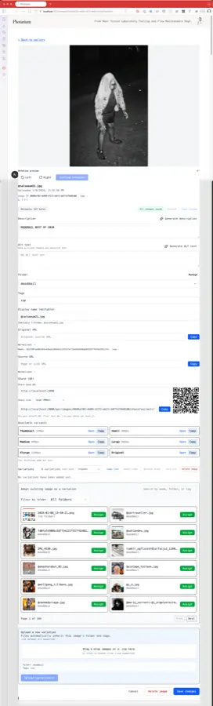
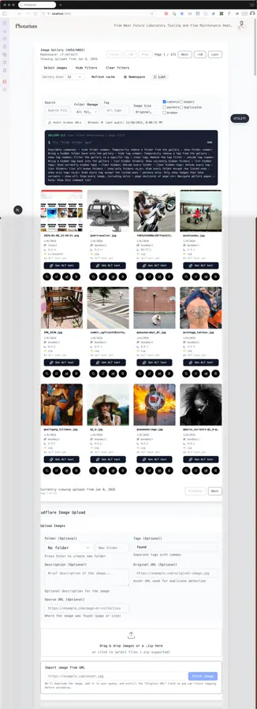

---

# Photarium

**Self-hosted visual asset workflow** on top of Cloudflare Images.  
Upload, organize, search, enrich, and publish image-heavy working libraries without handing off storage or delivery to a third-party DAM.

[Quick Start](#quick-start) · [Features & Operations](./docs/features_and_operations.md) · [Headless API](./docs/HEADLESS_API.md) · [Namespaces](./docs/namespace.md) · [Client Sites Publishing](./docs/client-sites-publishing.md) · [FAQ](./docs/faq.md) · [Website](https://bleeckerj.github.io/nfl-photarium/)

---

## What is Photarium?

> **⚠️ SECURITY WARNING**: Photarium is still a **local-first / internal-network-first** tool.
> The external upload endpoint (`/api/upload/external`) currently has **no built-in authentication**.
> Do not expose this app directly to the public internet unless you add auth middleware or put trusted network protection in front of it.

Photarium is a self-hosted asset workbench for small studios, researchers, content teams, and self-hosters who want Cloudflare Images plus a practical working surface for ingestion, curation, AI-assisted discovery, and lightweight publishing.

Use it when you need to:

- keep an internal image library organized with folders, tags, metadata, variants, and namespaces
- import media from local folders, direct URLs, scanned web pages, or helper scripts
- enrich assets with alt text, descriptions, prompts, haiku, and extracted workflow metadata
- deliver selected assets outward via CDN URLs, the headless API, or temporary client-facing pages

Run it on your own infrastructure. Keep the source images and delivery path under your control.

### What's New / Expanded Workflows

- **Page import and scan workflows** — Pull media from a URL, run browser-backed scans, queue candidates, then curate before upload.
- **Video-aware handling** — Ingest videos, extract frames, generate animated WebP previews, and work with image/video libraries side by side.
- **Filesystem and social ingest helpers** — Bulk-import local archives and use Instagram, Flickr, Threads, Telegram, and Discord-adjacent workflows when needed.
- **Client delivery workflows** — Assemble explicit client pages in Photarium and publish them to the adjacent Cloudflare Worker-based client-sites app.
- **Comfy workflow metadata** — Detect, store, index, and inspect ComfyUI workflow metadata alongside visual assets.

---

## Feature Overview

### Core Asset Workflow

- **Upload, queue, and organize** — Drag-and-drop uploads, folders, tags, metadata editing, and gallery-first browsing.
- **Stable asset delivery** — Cloudflare variants, CDN URLs, share links, and a headless upload/update surface.
- **Namespace-aware curation** — Separate projects or clients inside one Cloudflare Images account.
- **Operational control** — Duplicate detection, pagination, gallery filtering, EXIF handling, and backup/audit helpers.

### AI-Assisted Search & Enrichment

- **Semantic discovery** — Text-to-image search, similar-image search, antipode search, and color-based search when Redis/vector features are enabled.
- **Machine-assisted metadata** — Generate alt text, descriptions, Prompt This text, concept/haiku outputs, and batch embeddings.
- **Rich extras storage** — Keep larger descriptive metadata outside Cloudflare's metadata size limits while preserving filterable fields.

### Advanced Workflows

- **Page and URL import** — Scan pages for assets, handle authenticated scans with cookies, and review candidates before upload.
- **Media ingest** — ZIP intake, filesystem recursion, social-source helpers, and mixed image/video ingestion.
- **Video and motion workflows** — Extract frames, preview video metadata, and convert sequences or videos into animated WebP artifacts.
- **Client publishing** — Build curated client pages locally and publish them to the adjacent `photarium-client-sites` worker.
- **Comfy metadata indexing** — Detect and inspect embedded workflow JSON and workflow intent data for generated assets.

### Deep Control & Variants



Every asset detail view is built for curation rather than just upload-and-forget:

- **Metadata Management**: Edit title, folder, description, and tags while preserving original EXIF data.
- **Variant Assignment**: Designate specific images as variants (e.g., "Thumbnail," "Social Share") of a parent image. This keeps your library clean by grouping related assets under a single "master" image while serving optimized versions for specific contexts.
- **Accessibility & AI**: Generate and edit ALT text, descriptions, prompts, and other supplemental metadata.
- **Workflow context**: Inspect related assets, semantic neighbors, and ComfyUI-derived workflow information where available.

### Organized Gallery Management



The gallery stays useful as the library gets messy:

- **Smart Filtering**: Drill down by matching folders, tags, or specific time ranges.
- **Sticky Controls**: Filter/Sort bar stays pinned to the top, so you never lose context while scrolling deep lists.
- **Quick Actions**: Hover over any asset for instant access to copy URLs, edit metadata, inspect details, or download.

---

## Requirements

Before you start, you'll need:

- **Node.js 18+** with npm
- **A Cloudflare account** (free tier available)
  - [Create a free account →](https://dash.cloudflare.com/sign-up)
  - [Enable Cloudflare Images →](https://dash.cloudflare.com/?to=/:account/images/getting-started) (100k images/month, free)
- **ffmpeg / ffprobe** — Required for animated WebP generation and video frame probing/extraction
  - macOS: `brew install ffmpeg`
  - Ubuntu/Debian: `sudo apt install ffmpeg`
  - Windows: [Download from ffmpeg.org](https://ffmpeg.org/download.html)
  - Verify WebP encoder support: `ffmpeg -encoders | rg webp`
- **Optional:** OpenAI API key for AI-assisted ALT text, descriptions, prompts, haiku, and metadata refinement
- **Optional:** Redis Stack (via Docker or Cloud) for semantic search, color search, similar/antipode search, and embedding-backed workflows

See [docs/image-extras.md](docs/image-extras.md) for how Photarium stores rich per-image metadata outside Cloudflare metadata limits.

---

## Deployment Options

### 🚀 Simplified Mode (No Database)
Deploy the core asset workflow without managing Redis.
- **Features**: Upload, gallery, folders, tags, variants, metadata editing, page import basics, namespaces, and the core API.
- **Limitations**: No embedding-backed search, color search, similar/antipode workflows, or vector indexing.
- **Setup**: Just omit the `REDIS_URL` environment variable.

### 🧠 Full AI Mode (with Redis)
Unlock the full AI/discovery layer by connecting Redis Stack.
- **Features**: Everything above plus **semantic search**, **color search**, **similar/antipode**, embedding status, and richer discovery workflows.
- **Setup**: 
  1. Spin up a Redis Stack instance (see [Deployment Guide](./DEPLOYMENT.md)).
  2. Set `CACHE_STORAGE_TYPE=redis` and `REDIS_URL`.

### Recover Missing Embeddings After an Interrupted Run

If Photarium or Redis was interrupted before embedding generation finished, use the resumable backfill CLI:

```bash
# Inspect the current gap first
npm run embeddings:recover:dry-run

# Recover missing CLIP + color embeddings across the corpus
npm run embeddings:recover
```

The recovery run uses a persisted checkpoint at `data/embedding-backfill-checkpoints/recover-all.json`, throttles requests, and resumes safely if you rerun the same command after another interruption.

---

## Quick Start

### 1. Clone & Install

```bash
git clone https://github.com/bleeckerj/nfl-photarium.git
cd nfl-photarium
npm install
```

### 2. Configure Cloudflare

Grab three values from your Cloudflare dashboard:

1. **Account ID** — [Dashboard → right sidebar](https://dash.cloudflare.com/)
2. **API Token** — [API Tokens → Create Token](https://dash.cloudflare.com/profile/api-tokens)
   - Template: Custom token
   - Permission: `Cloudflare Images:Edit`
   - Resources: Your account
3. **Account Hash** — [Cloudflare Images dashboard](https://dash.cloudflare.com/?to=/:account/images/overview)

### 3. Environment Variables

```bash
cp .env.example .env.local
```

Edit `.env.local`:

```env
CLOUDFLARE_ACCOUNT_ID=abc123
CLOUDFLARE_API_TOKEN=your_token_here
# Optional: dedicated deploy token for client-sites worker automation
# CLIENT_SITES_CLOUDFLARE_API_TOKEN=your_client_sites_token_here
# Optional: managed client-site subdomain automation
# CLIENT_SITES_BASE_DOMAIN=clients.example.com
# CLIENT_SITES_ZONE_ID=your_zone_id_here
# CLIENT_SITES_USE_CUSTOM_DOMAINS=true
NEXT_PUBLIC_CLOUDFLARE_ACCOUNT_HASH=your_hash_here
IMAGE_NAMESPACE=default
NEXT_PUBLIC_IMAGE_NAMESPACE=default
```

**What these do:**
- `IMAGE_NAMESPACE` — Scopes uploads and duplicate detection (prevents collisions across projects)
- `NEXT_PUBLIC_IMAGE_NAMESPACE` — Seeds the UI; override anytime in app settings

### 4. Run It

```bash
npm run dev
```

Open [http://localhost:3000](http://localhost:3000)

---

## Client Sites Setup

Use this when you want Photarium to publish client review galleries to dedicated Cloudflare Workers, with clean URLs such as `andsons.clients.example.com`.

### What gets deployed

- Photarium remains the internal asset/workflow app.
- Each client site gets its own Worker and D1 database.
- Client page publishing pushes manifests from Photarium into the adjacent `adjacent/photarium-client-sites` Worker app.
- If custom domains are configured, deploy promotes the client site from `workers.dev` to `https://<client-slug>.<your-base-domain>`.

### Prerequisites

- Your main Photarium app is already configured and running locally.
- The parent domain for client sites is on Cloudflare.
- You know the Cloudflare zone ID for that parent domain.
- You have a Cloudflare API token that can deploy Workers and manage Worker domains.

### Required env vars for client-site deploys

Add these to `.env.local`:

```env
CLOUDFLARE_ACCOUNT_ID=abc123
NEXT_PUBLIC_CLOUDFLARE_ACCOUNT_HASH=your_images_account_hash

# Use either the shared token or a dedicated client-sites token.
CLOUDFLARE_API_TOKEN=your_default_cloudflare_token
# CLIENT_SITES_CLOUDFLARE_API_TOKEN=your_dedicated_client_sites_token
```

What each does:

- `CLOUDFLARE_ACCOUNT_ID`: Cloudflare account that owns the Workers and D1 databases.
- `NEXT_PUBLIC_CLOUDFLARE_ACCOUNT_HASH`: Cloudflare Images delivery hash used by published client sites.
- `CLOUDFLARE_API_TOKEN`: fallback deploy token if you do not provide the dedicated client-sites token.
- `CLIENT_SITES_CLOUDFLARE_API_TOKEN`: preferred token for client-site Worker deploys, domain attachment, and D1 provisioning.

Recommended permissions for the client-sites deploy token:

- `Workers Scripts:Edit`
- `Workers Scripts:Read`
- `D1:Edit`
- `Account Settings:Read`

### Optional env vars for clean client subdomains

These enable automatic attachment of URLs like `andsons.clients.example.com`:

```env
CLIENT_SITES_BASE_DOMAIN=clients.example.com
CLIENT_SITES_ZONE_ID=your_cloudflare_zone_id
CLIENT_SITES_USE_CUSTOM_DOMAINS=true
```

What each does:

- `CLIENT_SITES_BASE_DOMAIN`: parent hostname under your control. If the client slug is `andsons`, the deployed hostname becomes `andsons.clients.example.com`.
- `CLIENT_SITES_ZONE_ID`: Cloudflare zone ID for that base domain.
- `CLIENT_SITES_USE_CUSTOM_DOMAINS`: optional explicit flag. If omitted, custom-domain automation is still enabled when both values above are present.

If you do not set these, client sites still deploy, but the public URL remains the `workers.dev` hostname.

### Worker runtime secrets set during deploy

You do not manually set these in the adjacent Worker for normal deploys; the Photarium deploy flow uploads them:

- `CLIENT_SITES_PUBLISH_SECRET`
- `ACCESS_LINK_HASH_SECRET`
- `SESSION_SIGNING_SECRET`
- `IMAGES_ACCOUNT_HASH`
- optional `IMAGES_SIGNING_KEY`

### Create and deploy a client site

1. Start Photarium locally so you can manage client pages from the main app.
2. Create a client site:

```bash
npm run client-sites:create -- --name "And Sons"
```

This will:

- derive the slug (`and-sons`)
- provision the D1 database if needed
- build and deploy the adjacent Worker
- attach `and-sons.<base-domain>` if custom-domain automation is configured
- store the resulting `publicBaseUrl` in the client-site record

3. List deployed client sites:

```bash
npm run client-sites:list
```

4. Re-deploy or refresh a client site later:

```bash
npm run client-sites:deploy -- --site <client-site-id>
```

5. Inspect deployment health:

```bash
npm run client-sites:doctor -- --site <client-site-id>
```

### Publish a client page to that site

1. In the Photarium UI, create or edit a client page and assign it to the client site.
2. Select the assets to publish.
3. Publish from the UI, or via CLI:

```bash
npm run client-sites:publish -- --project <project-id>
```

The resulting share URL uses the client site’s `publicBaseUrl`, so once custom domains are attached it will look like:

```text
https://and-sons.clients.example.com/p/<public-slug>?k=<access-key>
```

### Access model

- Default outer URL: clean client subdomain.
- Default inner auth: existing secret-link flow (`?k=...`) plus signed session cookie in the client-site Worker.
- Cloudflare Access is not automatically provisioned by this repo yet; if you want site-wide login in front of the Worker, add it separately at the Cloudflare layer.

### Local development notes

- Local publish targets such as `http://127.0.0.1:8788` can omit the publish secret when the adjacent worker is running with `LOCAL_DEV_MODE=true`.
- Custom-domain attachment is a deployed-environment feature; local dev continues to use localhost or `workers.dev` style targets.

### Common failure points

- Missing `CLIENT_SITES_ZONE_ID`: deploy succeeds to `workers.dev` but cannot attach the clean client hostname.
- Wrong token scope: Worker deploy may succeed while domain attach or D1 provisioning fails.
- Wrong `NEXT_PUBLIC_CLOUDFLARE_ACCOUNT_HASH`: published galleries deploy but image delivery URLs break.
- Parent domain not on Cloudflare: automatic custom-domain attach will not work.

---

## Usage

### Uploading Images

1. Drag and drop into the upload area, or click to browse
2. (Optional) Select a folder and add comma-separated tags
3. Watch progress and copy the permanent Cloudflare URL

### Importing from URLs

- **Single image URL**: Fetch an image into the queue, edit metadata, then upload.
- **Page URL**: Scan a page for images, preview thumbnails in the queue, select what you want, and upload the rest.
  - Picks the largest `srcset` candidate when multiple sizes are available.
  - Filters out tiny assets below 8 KB.
  - Shows a placeholder when a preview is blocked; ingestion still works server-side.

### Finding Images

Use the search bar for filename/folder/tag lookups, or filter by specific criteria:
- **Grid View** — Visual browsing
- **List View** — Bulk operations and detailed metadata
- **Pagination** — Date-labeled controls jump between pages of 12

### Organizing Your Library

**Email Campaigns:**
```
Folder: email-campaigns
Tags: newsletter, promo, header
```

**Website Assets:**
```
Folder: website-images
Tags: hero, about, testimonial
```

**Social Media:**
```
Folder: social-media
Tags: instagram, facebook, linkedin
```

---

## External API

Push images from scripts, Astro components, or any HTTP client:

```bash
curl -X POST http://localhost:3000/api/upload/external \
  -F "file=@photo.png" \
  -F "folder=campaign-2025" \
  -F "tags=newsletter,featured" \
  -F "namespace=production"
```

**Fields:**
| Name | Required | Notes |
|------|----------|-------|
| `file` | ✅ | Image file (max 10 MB) |
| `folder` | ❌ | Folder name |
| `tags` | ❌ | Comma-separated list |
| `namespace` | ❌ | Override default namespace |
| `originalUrl` | ❌ | For duplicate detection |

**Response:**
```json
{
  "id": "abc123",
  "url": "https://imagedelivery.net/HASH/abc123/public",
  "variants": ["public", "thumbnail", "medium", "large"],
  "uploaded": "2025-01-08T14:22:00Z"
}
```

For detailed examples (Node scripts, Astro integration, remote URLs), see [EXTERNAL_UPLOAD_API.md](./EXTERNAL_UPLOAD_API.md).

---

## File System Watcher (Optional)

Automatically upload images from a folder:

```bash
npm run watch:drop-off
```

Watches `./drop-off`, uploads to the `drop-off` folder, and applies tags only when configured. Configure with env vars:

```env
DROP_OFF_DIR=/path/to/watch
DROP_OFF_FOLDER=drop-off
DROP_OFF_TAGS=archive,source
```

---

## Recursive Local Library Ingest (Images + Video)

Bulk-ingest a local directory tree (including nested subfolders) into a specific namespace. This is useful for imports like Discord/Midjourney download archives.

- Recursively scans for images and videos
- Uploads images and videos to the correct Photarium endpoints
- Includes the subdirectory path in `description`
- Optional AI-generated image `displayName` and 3-4 semantic tags
- Automatically keeps a local checkpoint of successful uploads and skips unchanged files on future runs (avoids repeat AI/API work)

Dry run first:

```bash
npm run fs:ingest -- \
  --root ~/Code/chester-downloads-discord-images \
  --namespace YOUR_NAMESPACE \
  --ai-metadata \
  --tag-count 4 \
  --throttle-ms 500 \
  --dry-run \
  --verbose
```

Run for real:

```bash
npm run fs:ingest -- \
  --root ~/Code/chester-downloads-discord-images \
  --namespace YOUR_NAMESPACE \
  --folder midjourney-discord \
  --description-prefix "Midjourney Discord export" \
  --include-path-tags \
  --ai-metadata \
  --tag-count 4 \
  --throttle-ms 500
```

Notes:
- AI metadata applies to images only (videos still get tags/description, not `displayName`)
- Requires the local Photarium app running at `http://localhost:3000` unless overridden with `--api-base`
- Use `--throttle-ms` to globally pace uploads (for example `500` = ~2 uploads/sec max)
- AI metadata requires `OPENAI_API_KEY` configured in the Photarium app environment
- Display-name generation via `/api/images/:id/display-name` and `/api/display-name/suggest` defaults to `gpt-4.1-nano`; set `OPENAI_DISPLAY_NAME_MODEL` to override it
- Semantic-tag generation via `/api/images/:id/tags` defaults to `gpt-4.1-nano`; set `OPENAI_TAGS_MODEL` to override it
- Checkpoints are stored under `data/fs-ingest-checkpoints/` (keyed by source root + namespace). A file is considered unchanged when its path, size, and modified time match.

---

## Architecture

**Self-hosted** — Run on your own server, Vercel, Railway, or any Node.js host  
**Stateless** — All metadata stored in Cloudflare; no database required  
**Namespace-aware** — Isolate images across projects or teams on one account

---

## Deployment

### Vercel (Recommended)

1. Push to GitHub
2. [Connect to Vercel](https://vercel.com/import)
3. Add env vars in dashboard
4. Deploy

### Other Platforms

Works on any platform supporting Node.js 18+:
- **Railway** — [Docs](https://railway.app/)
- **Render** — [Docs](https://render.com/)
- **DigitalOcean** — App Platform
- **Netlify** — Functions + edge

---

## Tech Stack

| Layer | Technology |
|-------|------------|
| Framework | Next.js 15 (App Router) + TypeScript |
| Styling | Tailwind CSS |
| UI Components | Lucide React icons |
| Image Host | Cloudflare Images API |
| Database | None (serverless) |

---

## Testing

```bash
npm run test
```

Runs the vitest suite (includes external API coverage).

---

## Development

```bash
# Development server (with Turbopack)
npm run dev

# Build for production
npm run build

# Start production server
npm start

# Lint
npm run lint
```

**Scripts:**
- `npm run namespace:backfill` — Tag existing Cloudflare images with a namespace
- `npm run refresh:hash-cache` — Rebuild the duplicate detection cache
- `npm run audit:broken` — Find broken image URLs
- `npm run diag:duplicates` — Analyze duplicate uploads
- `npm run ig:auth -- --username darthjulian` — Open headed browser for one-time Instagram login
- `npm run ig:ingest -- --username darthjulian --max-pages 10` — Ingest Instagram media metadata with checkpoint resume
- `npm run ig:url -- --url https://www.instagram.com/reel/<shortcode>/` — Pull one Instagram post/reel and push media to Photarium by default

### Instagram Ingest (`npm run ig:ingest`)

`ig:ingest` crawls Instagram profile media via an authenticated browser session and writes each media item as one NDJSON record. It is intended for ingesting your own Instagram media so you can backup your photos/posts for posterity and management/tagging inside Photarium. It supports:

- checkpointed pagination (resume from last `next_max_id`)
- optional local image downloads
- optional push into this app's API (`/api/upload/external` for images, `/api/import/page/upload-video` for videos)

This workflow is implemented in `scripts/instagram-ingest.mjs`.

#### Quick Start

1. Authenticate once with a persistent browser profile:

```bash
npm run ig:auth -- --username darthjulian
```

2. Run ingest:

```bash
npm run ig:ingest -- --username darthjulian
```

3. Inspect output:

- NDJSON: `data/instagram/<username>.ndjson`
- checkpoint: `data/instagram/<username>.checkpoint.json`
- auth metadata: `data/instagram/<username>.auth.json`

#### Single URL (post/reel)

Use this when you want one specific Instagram URL (including videos) pushed to Photarium:

```bash
npm run ig:url -- --url https://www.instagram.com/reel/<shortcode>/ --namespace cf-default
```

Use `--no-push-cloudflare` if you want to extract metadata without uploading.

Notes:
- Reuses your authenticated browser profile from `ig:auth`
- Extracts media URLs from the page payload/meta and pushes images/videos through existing Photarium APIs
- Appends a normalized NDJSON record to `data/instagram/<username>.ndjson`

#### What The Script Does

1. Launches Puppeteer with a persistent profile directory (`.cache/instagram-profile` by default).
2. Verifies session by fetching profile data from Instagram web endpoints.
3. Pages profile feed items (`/api/v1/feed/user/<userId>`) using `next_max_id`.
4. Maps each item to a normalized record (caption, counts, `imageUrls`, `videoUrls`, permalink, timestamps, etc.).
5. Appends one JSON line per item to the NDJSON file.
6. Writes checkpoint progress after each page so restart is resume-safe.
7. Optionally downloads image files and/or pushes media into your local API.

#### Command Form

```bash
npm run ig:ingest -- --username <name> [options]
```

Use `--` so npm passes arguments to the script.

#### Options

| Option | Default | Purpose |
|-------|---------|---------|
| `--username <name>` | `darthjulian` | Instagram username to ingest |
| `--profile-dir <path>` | `.cache/instagram-profile` | Persistent Chromium profile directory |
| `--count <n>` | `12` | Items requested per page |
| `--max-pages <n>` | `0` | Stop after N pages (`0` = unbounded) |
| `--delay-ms <n>` | `1200` | Delay between page fetches |
| `--request-delay-ms <n>` | `800` | Delay between media push requests |
| `--output <path>` | `data/instagram/<username>.ndjson` | NDJSON output file |
| `--checkpoint <path>` | `data/instagram/<username>.checkpoint.json` | Resume checkpoint file |
| `--download-dir <path>` | none | Download discovered images to disk |
| `--push-cloudflare` | `false` | Push media into app APIs during ingest |
| `--skip-video-push` | `false` | With `--push-cloudflare`, skip video uploads |
| `--api-base <url>` | `http://localhost:3000` | Base URL for local app API |
| `--no-resume` | resume on | Ignore checkpoint and start from newest items |
| `--headful` | headless | Run ingest with visible browser window |
| `-v`, `--verbose` | very verbose by default | Increase logging verbosity |
| `--quiet` | off | Minimal logging |
| `--no-color` | off | Disable ANSI colors |

#### Output Schema (Per NDJSON Line)

Each line includes fields like:

- `source`, `fetchedAt`, `username`, `userId`
- `mediaId`, `pk`, `shortcode`, `permalink`
- `mediaType`, `productType`
- `takenAtUnix`, `takenAtIso`
- `likeCount`, `commentCount`, `caption`
- `imageUrls[]`, `videoUrls[]`
- `cloudflare[]` (only populated when push is enabled)

#### Typical Usage Patterns

Baseline ingest:

```bash
npm run ig:ingest -- --username darthjulian
```

Quiet mode:

```bash
npm run ig:ingest -- --username darthjulian --quiet
```

Fetch only a fixed amount for testing:

```bash
npm run ig:ingest -- --username darthjulian --max-pages 3 --count 12
```

Download images while ingesting:

```bash
npm run ig:ingest -- --username darthjulian --download-dir data/instagram/darthjulian-images
```

Start fresh from newest items (ignore checkpoint):

```bash
npm run ig:ingest -- --username darthjulian --no-resume
```

Use visible browser for debugging auth/session issues:

```bash
npm run ig:ingest -- --username darthjulian --headful
```

#### Pushing To Cloudflare-Backed API During Ingest

Enable push:

```bash
npm run ig:ingest -- --username darthjulian --push-cloudflare
```

When enabled, images are sent to:

- `POST /api/upload/external`
- form fields include `folder=instagram`, `tags=instagram,<username>`, `sourceUrl`, `originalUrl`, and `description=<permalink>` when available

Videos are sent to:

- `POST /api/import/page/upload-video`
- with the same folder/tag/source/original metadata pattern

If video ingest should be deferred:

```bash
npm run ig:ingest -- --username darthjulian --push-cloudflare --skip-video-push
```

Tune per-asset pacing to reduce throttling:

```bash
npm run ig:ingest -- --username darthjulian --push-cloudflare --request-delay-ms 1500
```

#### Replay Deferred Videos

The replay command uploads deferred videos to Photarium/Cloudflare by default:

```bash
npm run ig:videos -- --username darthjulian
```

Equivalent direct command:

```bash
node scripts/instagram-ingest.mjs videos-from-ndjson --username darthjulian
```

You can also replay by explicit file path (no username required):

```bash
npm run ig:videos -- --input data/instagram/darthjulian.ndjson --namespace cf-default
```

If replay reports `rows_likely_video_but_no_video_url > 0`, use the recovery helper to re-resolve likely-video rows first, then replay in one command:

```bash
npm run ig:recover-videos -- --input data/instagram/darthjulian.ndjson --namespace cf-default
```

Useful helper options:

- `--headful`: run the resolve step with a visible browser
- `--limit <n>`: resolve only the first `n` missing shortcodes
- `--skip-resolve`: replay only
- `--skip-replay`: resolve only
- `--dry-run`: print planned commands without running them

#### Checkpoint & Resume Behavior

- Checkpoint is written after every fetched page.
- Resume uses `nextMaxId` from checkpoint when present.
- If checkpoint is missing, ingest starts from newest.
- `--no-resume` forces a new pass from newest even if checkpoint exists.

Checkpoint fields include `pagesFetched`, `recordsWritten`, `nextMaxId`, and `updatedAt`.

#### Common Failure Modes

- `Login required` / `require_login`: session expired or missing. Re-run:
  `npm run ig:auth -- --username <name>`
- Feed request status not `200`: account/session/network issue; retry with `--headful` for visibility.
- Video push temporary failures (`520/502/503/504`, timeout): script retries internally with backoff.
- Duplicate image push (`409`): treated as "already exists", counted separately (not a hard failure).

#### Operational Notes

- The script appends to NDJSON; if you want a clean file, remove or rotate output first.
- Keep one username per output/checkpoint file to preserve clean resume semantics.
- For long runs, prefer conservative delays (`--delay-ms`, `--request-delay-ms`) to reduce platform/API friction.

---

## Documentation

- **[Features & Operations](./docs/features_and_operations.md)** — Primary feature map and operational guide
- **[Headless API](./docs/HEADLESS_API.md)** — Route-level API reference for uploads, search, metadata, and media flows
- **[Client Sites Publishing](./docs/client-sites-publishing.md)** — Contract-based publishing into the adjacent public client-sites worker
- **[Namespaces](./docs/namespace.md)** — Project isolation, namespace storage, and migration behavior
- **[FAQ](./docs/faq.md)** — Common questions about search behavior, Redis, and namespace usage
- **[Image Extras](./docs/image-extras.md)** — How larger metadata is stored outside Cloudflare's metadata limits

---

## Contributing

Found a bug? Have a feature request? Open an issue or PR on [GitHub](https://github.com/bleeckerj/nfl-photarium).

---

## License

MIT
