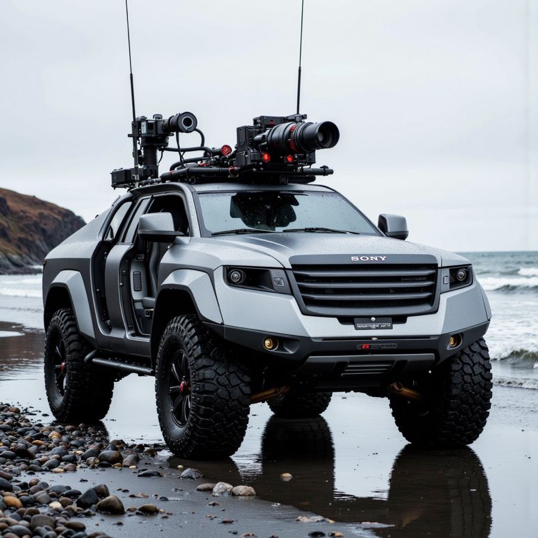
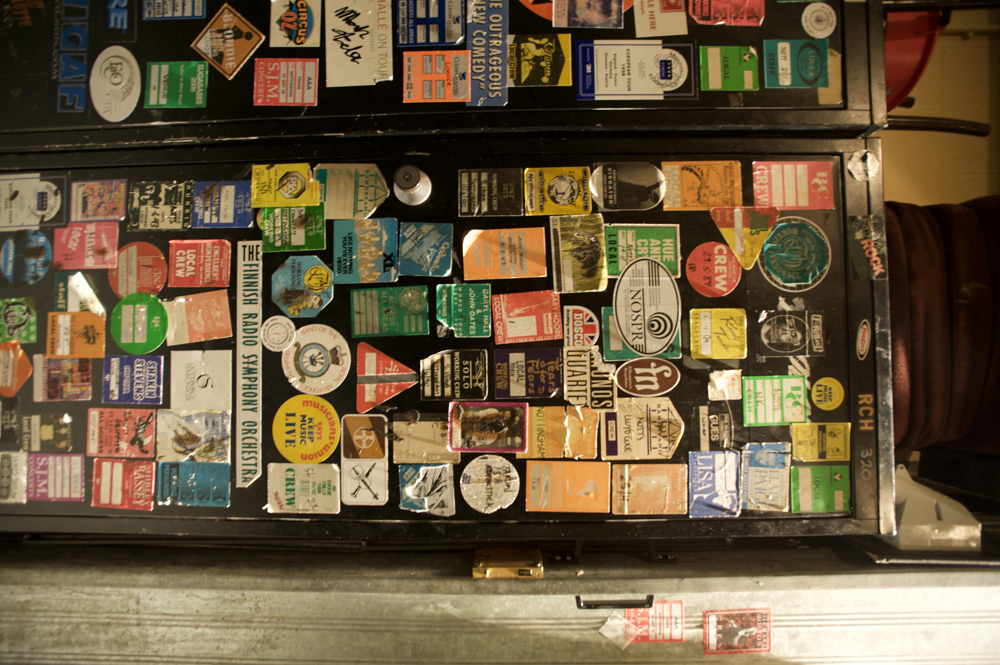

# OpenAI Semantic Tag Benchmark

This bundle archives the semantic-tag benchmark that compared low-cost image-capable OpenAI models for `/api/images/:id/tags`.

Recommendation: use `gpt-4.1-nano` as the default semantic-tag model.

## Goal

Find the cheapest model that produces usable six-tag semantic outputs for image tagging without introducing obvious quality regressions.

The benchmark focused on low-cost candidates:

- `gpt-4o-mini`
- `gpt-5.4-nano`
- `gpt-5-mini`
- `gpt-4.1-nano`
- `gpt-4.1-mini`

## Methodology

The fair comparison used the OpenAI Responses API with strict JSON schema output for all evaluated models.

Shared instructions:

```text
You create compact single-word semantic tags for images. Return JSON only.
```

Shared prompt template:

```text
Analyze this image and return exactly 6 semantic tags.
Each tag must be a single lowercase ASCII word.
Prefer concrete scene, subject, object, mood, material, or setting terms.
No phrases, no punctuation, no explanation.
Filename hint: <filename>
```

Shared JSON schema:

```json
{
  "type": "object",
  "additionalProperties": false,
  "required": ["tags"],
  "properties": {
    "tags": {
      "type": "array",
      "minItems": 6,
      "maxItems": 6,
      "items": {
        "type": "string",
        "pattern": "^[a-z0-9-]+$"
      }
    }
  }
}
```

The route implementation in this repo was not migrated to Responses API as part of this decision. The benchmark used a uniform API shape to compare models fairly, then the repo adopted `gpt-4.1-nano` because it already works with the current route implementation.

## Final Recommendation

Choose `gpt-4.1-nano` for `/api/images/:id/tags`.

Why:

- It was much cheaper than `gpt-4.1-mini`.
- It was materially cheaper than `gpt-5-mini` and `gpt-5.4-nano`.
- Its outputs were more stable than `gpt-5-nano` in earlier exploratory runs.
- In this benchmark it had the best cost/quality tradeoff among the low-cost models tested.

Notes:

- `gpt-5-mini` was the strongest alternative if slightly higher cost is acceptable.
- `gpt-5.4-nano` worked with `reasoning.effort: "none"` but produced a clearly weak result on the sticker-covered case image.
- `gpt-4o-mini` was unexpectedly expensive for image inputs in this workflow.
- Early GPT-5-family exploratory runs initially failed due to unsupported parameters. Only the compatible reruns captured in this bundle should be treated as authoritative.

## Cost Summary

| Model | Success | Avg cost / image (USD) | Summary |
| --- | ---: | ---: | --- |
| `gpt-4.1-nano` | 4/4 | 0.0003118 | Best cost/quality tradeoff |
| `gpt-5.4-nano` | 4/4 | 0.0004600 | Cheap, but one poor qualitative result |
| `gpt-5-mini` | 4/4 | 0.0004666 | Strong alternative, slightly pricier |
| `gpt-4.1-mini` | 4/4 | 0.0008439 | Stable but not cost-effective here |
| `gpt-4o-mini` | 4/4 | 0.0051290 | Too expensive for this workflow |

## Image Results

### Image A


| Model | Tags | Cost (USD) |
| --- | --- | ---: |
| `gpt-4o-mini` | `truck, mountain, desert, nature, vehicle, landscape` | 0.0055549 |
| `gpt-5.4-nano` | `truck, mountains, desert, snow, wilderness, scenic` | 0.0002958 |
| `gpt-5-mini` | `expedition, truck, mountains, desert, camper, wilderness` | 0.0004120 |
| `gpt-4.1-nano` | `vehicle, mountains, desert, animals, clouds, landscape` | 0.0002636 |
| `gpt-4.1-mini` | `truck, desert, mountain, snow, bird, vehicle` | 0.0007192 |

### Image B



| Model | Tags | Cost (USD) |
| --- | --- | ---: |
| `gpt-4o-mini` | `vehicle, beach, outdoor, camera, rugged, photography` | 0.0038546 |
| `gpt-5.4-nano` | `suv, offroad, camera, mount, beach, overcast` | 0.0002592 |
| `gpt-5-mini` | `offroad, pickup, camera, beach, mudguard, overcast` | 0.0003643 |
| `gpt-4.1-nano` | `car, offroad, camera, film, mountain, beach` | 0.0002262 |
| `gpt-4.1-mini` | `vehicle, camera, beach, offroad, technology, wet` | 0.0006208 |

### Image C


| Model | Tags | Cost (USD) |
| --- | --- | ---: |
| `gpt-4o-mini` | `door, yellow, number, room, handle, interior` | 0.0055527 |
| `gpt-5.4-nano` | `door, number, 25, yellow, paint, handle` | 0.0006378 |
| `gpt-5-mini` | `door, yellow, number, metal, handle, painted` | 0.0005428 |
| `gpt-4.1-nano` | `door, yellow, number, metal, handle, wall` | 0.0003765 |
| `gpt-4.1-mini` | `door, number, yellow, wall, metal, handle` | 0.0010164 |

### Image D



| Model | Tags | Cost (USD) |
| --- | --- | ---: |
| `gpt-4o-mini` | `stickers, door, black, crew, labels, backstage` | 0.0055538 |
| `gpt-5.4-nano` | `bulletinboard, stickers, posters, corridor, crowd, warmlight` | 0.0006472 |
| `gpt-5-mini` | `stickers, locker, door, colorful, venue, collage` | 0.0005475 |
| `gpt-4.1-nano` | `stickers, cabinet, stickers, metal, colorful, street` | 0.0003808 |
| `gpt-4.1-mini` | `door, stickers, music, venue, wall, label` | 0.0010192 |

## Artifacts

Raw benchmark artifacts are committed alongside this report:

- [Expanded benchmark](./artifacts/semantic-tag-expanded-benchmark.json)
- [Corrected `gpt-5.4-nano` rerun](./artifacts/semantic-tag-gpt54nano-none.json)
- [Merged summary](./artifacts/final-summary.json)

The merged summary is the easiest file to consume programmatically when future model comparisons are added.
