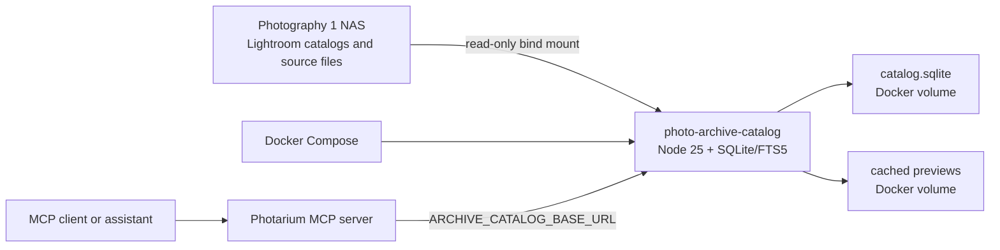

# Lightroom Photo Archive Catalog

The Photo Archive Catalog is an offline, read-only search index for Lightroom catalogs and the photograph files stored on the `Photography 1` NAS. It gives Photarium and its MCP server a durable metadata surface that remains useful when the NAS is disconnected.

The archive has its own service, database, preview cache, and search vocabulary. The global Photarium catalog remains focused on the actively managed Cloudflare Images collection.

## What this provides

- A searchable mirror of Lightroom catalog metadata.
- Search across filenames, folder paths, Lightroom keywords, captions, copyright fields, collections, and archive annotations.
- Lightroom filters for capture date, rating, pick state, catalog, path, keyword, and collection.
- Local related-term expansion for searches such as `Trust`.
- Cached thumbnails that can be returned while the NAS is offline.
- MCP tools for search, metadata inspection, previews, keyword/collection browsing, and annotations.
- Read-only source handling with active-catalog lock protection.
- Separate persistent storage for metadata, previews, and backup snapshots.

## Architecture



The catalog service listens on port `8790`. The MCP server reaches it through `ARCHIVE_CATALOG_BASE_URL`, which defaults to `http://localhost:8790`.

## Storage model

The Compose service uses three named Docker volumes:

| Volume | Container path | Contents |
| --- | --- | --- |
| `archive_catalog_data` | `/data` | SQLite database and SQLite journal/WAL files |
| `archive_catalog_previews` | `/data/previews` | Generated JPEG thumbnails |
| `archive_catalog_backups` | `/data/backups` | Reserved backup snapshots |

The NAS is mounted at `/sources/photography-1` with read-only access. The service never copies the original photographs into Docker storage.

The database contains derived metadata and provenance. It does not replace Lightroom and it does not write Lightroom catalog records, XMP sidecars, ratings, flags, keywords, or develop settings.

## Source path mapping

Lightroom stores absolute paths from the computer and volume where the catalog was created. The container sees the NAS at `/sources/photography-1`.

During import, a catalog root is mapped to the container source root when the final directory names match after case and punctuation normalization. For example:

```text
Lightroom root: /Volumes/Photography 1/
Container root: /sources/photography-1/
```

The original Lightroom root is preserved in `rootPath`. The mapped path is stored in `absolutePath` for source availability and preview generation.

Catalog roots from other volumes remain in the index as provenance records. Their assets are searchable, with `sourceAvailable: false` when the corresponding volume is not mounted.

## Lightroom safety model

Catalogs are opened using SQLite immutable read-only URI mode:

```text
file:/path/to/catalog.lrcat?mode=ro&immutable=1
```

This prevents SQLite from creating journals or changing the Lightroom catalog while it is being inspected.

Before importing a catalog, the service checks for a neighboring lock file:

```text
/path/to/catalog.lrcat.lock
```

Locked catalogs are skipped and reported in the sync result. The explicit override is available for controlled recovery work:

```bash
npm run archive:sync -- --allow-locked
```

Use that override only after confirming Lightroom is closed and the lock file is stale.

If the NAS is unavailable, the HTTP sync endpoint returns `409` and leaves the existing database untouched. Missing individual files remain in the database with `sourceAvailable: false`; sync does not delete them.

## What is imported

The importer reads the Lightroom tables used by the current catalog family, including:

- `Adobe_images`
- `AgLibraryFile`
- `AgLibraryFolder`
- `AgLibraryRootFolder`
- `AgLibraryKeyword`
- `AgLibraryKeywordImage`
- `AgLibraryCollection`
- `AgLibraryCollectionImage`
- `AgLibraryIPTC` when available

The indexed asset record includes:

- stable archive asset ID
- catalog ID and Lightroom image/file IDs
- filename, extension, and Lightroom file format
- capture and original capture timestamps
- rating, pick state, color labels, dimensions, copy name, and missing-sidecar flag
- Lightroom folder/root provenance and mapped source path
- source availability, mtime, size, and optional SHA-256 content hash
- caption and copyright fields when available
- keywords and collections
- separate archive note, annotation tags, and shortlist state

The importer recognizes still-image, video, and other Lightroom file formats as metadata records. Preview support depends on the source format and available embedded or decodable image data.

## Catalog and asset IDs

Catalog IDs are stable SHA-256 identifiers derived from the normalized catalog path.

Asset IDs are stable SHA-256 identifiers derived from the catalog path and Lightroom `Adobe_images.id_local`. A catalog re-sync therefore updates the same archive assets instead of creating new IDs for the same Lightroom records.

The IDs are archive provenance identifiers. They are not Cloudflare Images IDs and should not be passed to Photarium image mutation tools.

## Import workflow

### First startup

From the repository root:

```bash
docker compose up -d photo-archive-catalog
curl -fsS http://localhost:8790/health
curl -fsS http://localhost:8790/status | jq
```

The first command builds or starts the catalog service. The health endpoint does not require the NAS to be connected once the service has been created.

### Full explicit sync

Connect the NAS, then run:

```bash
npm run archive:sync
```

The sync recursively discovers `.lrcat` files under the mounted source root. Directories ending in `.lrdata` and hidden directories are skipped during discovery.

The command reports each catalog and its indexed/available asset counts. The operation is transactional: a failed catalog write rolls back the current sync transaction.

### Optional content hashes

The default import uses Lightroom metadata, file size, and file mtime. A slower optional pass computes SHA-256 hashes for currently available source files:

```bash
npm run archive:sync -- --hash
```

Hashes are derived metadata. They do not modify source files.

### Import one catalog for a staged rollout

The HTTP API accepts container-visible catalog paths. This is useful for a small test catalog or a known Nokia catalog before importing every catalog:

```bash
curl -fsS -X POST http://localhost:8790/sync \
  -H 'content-type: application/json' \
  -d '{"catalogPaths":["/sources/photography-1/Photography_LR4_2017.lrcat"]}' | jq
```

The repository wrapper intentionally performs the normal all-catalog sync. Use the HTTP form for staged selection.

## Search behavior

The service uses SQLite FTS5 for text search. The indexed text projection combines:

- filename
- folder path
- keyword names and keyword genealogy text
- caption
- copyright
- collection names
- archive note and annotation tags

`archive_search` returns exact text matches first. When `expandQuery` is enabled, it adds local curated related terms and labels additional records with `matchType: "expanded"`. Expanded terms are search-time additions; they are never written into Lightroom or into the archive keyword table.

The initial vocabulary includes relationships such as:

```text
trust      -> identity, privacy, security, safety, reliability, verification, reputation
identity   -> trust, privacy, security, authentication, reputation
privacy    -> trust, identity, security, consent, data
security   -> trust, privacy, safety, identity, verification
nokia      -> mobile, phone, telecom, research, design
design     -> prototype, research, product, interface, strategy
```

The vocabulary is intentionally local and reviewable. It is not a claim that every expanded result is semantically relevant.

### Search example: Nokia and Trust

```bash
curl -fsS -X POST http://localhost:8790/search \
  -H 'content-type: application/json' \
  -d '{
    "query":"Nokia Trust",
    "path":"NokiaTrust",
    "limit":24,
    "expandQuery":true
  }' | jq
```

The same query through MCP is:

```text
archive_search({
  query: "Nokia Trust",
  path: "NokiaTrust",
  limit: 24,
  expandQuery: true,
  includePreviews: true
})
```

### Available filters

| Filter | Meaning |
| --- | --- |
| `query` | FTS text terms |
| `from` / `to` | Inclusive capture-time bounds |
| `minRating` | Minimum Lightroom rating |
| `pick` | Lightroom pick-state value |
| `catalogId` | One imported catalog |
| `path` | Substring match against source or folder path |
| `keyword` | Keyword name filter |
| `collection` | Collection name filter |
| `limit` | Result limit, capped at 200 |
| `offset` | Pagination offset |
| `expandQuery` | Enable local vocabulary expansion; default behavior is enabled |
| `includePreviews` | MCP-only: attach thumbnails for up to 12 results |

## Preview workflow

Preview generation is on demand.

1. A cached preview is returned when its cache file exists.
2. Raster formats are decoded and resized with Sharp.
3. Raw formats such as DNG are passed to ExifTool to extract `PreviewImage`, `JpgFromRaw`, or `ThumbnailImage` data.
4. The extracted image is resized to fit within 1600 pixels and stored as a JPEG in `/data/previews`.
5. Unsupported files or unavailable source files return no preview while metadata remains searchable.

`archive_get_preview` returns two MCP content blocks: the asset metadata as text and the thumbnail as image content. `archive_search` can attach thumbnails for its first 12 results.

Cached thumbnails remain available while the NAS is offline. The current cache is keyed by archive asset ID. A future cache invalidation pass should compare source mtimes when source edits need to be reflected immediately.

## Archive annotations

Annotations are stored in SQLite and are separate from Lightroom authority. They are intended for project work such as the Nokia `Trust` search.

Example:

```bash
curl -fsS -X POST \
  http://localhost:8790/assets/ASSET_ID/annotation \
  -H 'content-type: application/json' \
  -d '{
    "note":"Candidate for Nokia Trust project",
    "tags":["Nokia Trust","project shortlist"],
    "shortlist":true
  }' | jq
```

Annotations are preserved across catalog re-syncs for assets whose stable IDs still exist. Annotation text and tags are included in FTS search.

## HTTP API

The service is an internal trusted-network API. It has no user authentication layer. Keep port `8790` on localhost or on the existing trusted MCP path; do not expose it directly to the public internet.

| Method | Route | Purpose |
| --- | --- | --- |
| `GET` | `/health` | Liveness check |
| `GET` | `/status` | Counts, source connection state, paths, and last sync |
| `GET` | `/catalogs` | Imported catalog summaries |
| `POST` | `/sync` | Explicit import; accepts `hashFiles`, `allowLockedCatalog`, and optional `catalogPaths` |
| `POST` | `/search` | FTS search and filters |
| `GET` | `/keywords?query=...` | Keyword counts |
| `GET` | `/collections?query=...` | Collection counts |
| `GET` | `/assets/:id` | One asset metadata record |
| `GET` | `/assets/:id/preview` | One JPEG thumbnail as binary response |
| `POST` | `/assets/:id/annotation` | Save a separate archive annotation |

## MCP tools

The MCP server exposes these archive tools:

| Tool | Purpose |
| --- | --- |
| `archive_catalog_status` | Service, source, database, asset, and preview status |
| `archive_list_catalogs` | Imported catalogs and availability counts |
| `archive_search` | Search/filter archive records, with optional previews |
| `archive_get_asset` | Inspect one asset and its provenance |
| `archive_get_preview` | Return metadata plus an image attachment |
| `archive_list_keywords` | Browse keyword counts |
| `archive_list_collections` | Browse collection counts |
| `archive_save_annotation` | Save note/tags/shortlist state |

The MCP server requires its own build and the archive service URL:

```bash
cd mcp-server
npm install
npm run build
export PHOTARIUM_BASE_URL=http://localhost:3000
export ARCHIVE_CATALOG_BASE_URL=http://localhost:8790
npm run dev
```

## Configuration reference

### Host-side Compose variable

| Variable | Default | Purpose |
| --- | --- | --- |
| `PHOTOGRAPHY_ARCHIVE_HOST_PATH` | `/Volumes/Photography 1` | Host path bound read-only into the service |

### Archive service variables

| Variable | Default | Purpose |
| --- | --- | --- |
| `ARCHIVE_DATABASE_PATH` | `/data/catalog.sqlite` | SQLite database path |
| `ARCHIVE_PREVIEW_ROOT` | `/data/previews` | Preview cache path |
| `ARCHIVE_BACKUP_ROOT` | `/data/backups` | Backup directory path |
| `ARCHIVE_SOURCE_ROOT` | `/sources/photography-1` | Read-only source mount inside the container |
| `ARCHIVE_PORT` | `8790` | HTTP port |

### MCP variable

| Variable | Default | Purpose |
| --- | --- | --- |
| `ARCHIVE_CATALOG_BASE_URL` | `http://localhost:8790` | URL used by archive MCP handlers |

## Offline operation

The intended offline state is:

1. The archive service remains running.
2. SQLite metadata and preview volumes remain attached.
3. The NAS bind mount is disconnected or unavailable.
4. `archive_catalog_status`, `archive_search`, `archive_get_asset`, keyword browsing, collection browsing, and cached previews continue to work.
5. New syncs return `409` until the source is connected again.
6. A preview for an asset without a cached thumbnail returns `404` until the source becomes available.

If Docker cannot start a bind mount because the host path does not exist, use a stable host mount point or start the Compose service after the NAS path is available. Once the service is running, its derived data is independent of the NAS.

## Backup and restore

The database and preview cache are Docker volumes. Identify their actual names first:

```bash
docker volume ls | grep archive_catalog
```

Stop the service before taking a filesystem-level snapshot:

```bash
docker compose stop photo-archive-catalog
mkdir -p backups/archive-catalog
docker run --rm \
  -v <project>_archive_catalog_data:/data:ro \
  -v "$PWD/backups/archive-catalog:/backup" \
  alpine tar czf /backup/catalog-data.tgz -C /data .
docker run --rm \
  -v <project>_archive_catalog_previews:/data:ro \
  -v "$PWD/backups/archive-catalog:/backup" \
  alpine tar czf /backup/catalog-previews.tgz -C /data .
docker compose start photo-archive-catalog
```

Replace `<project>` with the Compose project prefix shown by `docker volume ls`. Keep the database and preview snapshots from the same point in time.

For restore, stop the service, extract the database snapshot into `archive_catalog_data`, extract the preview snapshot into `archive_catalog_previews`, start the service, and verify:

```bash
curl -fsS http://localhost:8790/status | jq
```

A database backup is portable metadata. The original Lightroom catalogs and source photographs remain the source-of-truth archive and need their own NAS backup strategy.

## Troubleshooting

### `sourceConnected: false`

Check the host mount and Compose variable:

```bash
ls -ld "/Volumes/Photography 1"
echo "$PHOTOGRAPHY_ARCHIVE_HOST_PATH"
docker compose config
```

The service can still serve cached metadata and previews. Connect the NAS before running sync.

### Sync returns `409`

The source root is unavailable. Existing data was intentionally left unchanged.

### A catalog is skipped as locked

Close Lightroom and confirm the `.lrcat.lock` file is stale. Remove a stale lock only through the normal Lightroom recovery procedure, or use the explicit `--allow-locked` override after verification.

### Records exist but `sourceAvailable` is false

The catalog record may reference another historical volume, the source path may have moved, or the source file may be missing. Inspect `rootPath`, `absolutePath`, and `relativePath` with `archive_get_asset`.

### A preview is unavailable

Check whether the asset has a source file and whether the format has an embedded preview. Videos and unsupported raw formats can remain metadata-searchable without a generated still thumbnail.

### MCP tools report an archive catalog connection error

Check the service and MCP URL from the same environment where the MCP server runs:

```bash
curl -fsS "$ARCHIVE_CATALOG_BASE_URL/health"
```

When the MCP server runs in another container, `localhost` refers to that container. Use the Compose service name or the trusted host address instead.

## Recommended rollout

1. Start the service and import the smallest catalog as a smoke test.
2. Confirm `/status`, `/catalogs`, and a known keyword search.
3. Search `Nokia Trust` with `path: NokiaTrust` and inspect a few records.
4. Generate previews for a small shortlist with `archive_get_preview`.
5. Save project annotations and confirm they survive a re-sync.
6. Disconnect the NAS and confirm metadata and cached previews remain available.
7. Import all discovered catalogs with `npm run archive:sync`.
8. Take a database/preview snapshot after the first successful full import.

## Current boundaries and future work

The current implementation deliberately keeps the first archive service understandable and local. The following items remain future extensions:

- Incremental catalog-table updates that avoid re-reading every selected catalog on each sync.
- Full Lightroom keyword hierarchy and genealogy preservation across all catalog variants.
- A resumable background hash queue with progress checkpoints.
- Preview prewarming by search shortlist or project folder.
- Archive-specific visual embeddings stored outside Photarium’s global vector index.
- Content-based deduplication across multiple Lightroom catalogs.
- Optional XMP/sidecar reconciliation with explicit authority rules.
- Authenticated remote access when the trusted MCP path is insufficient.

These extensions should preserve the source-read-only and separate-archive invariants.
